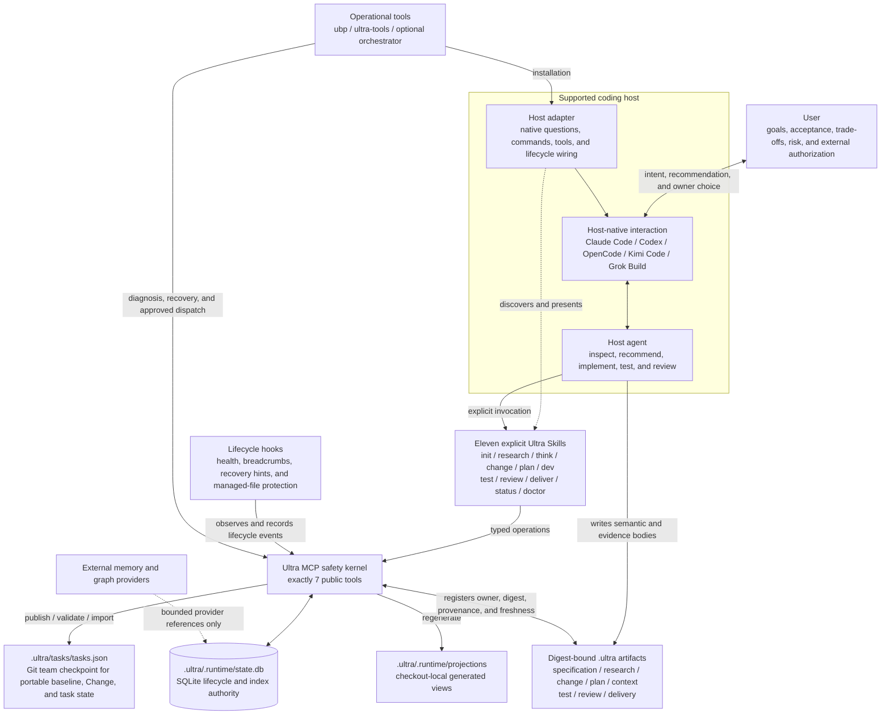
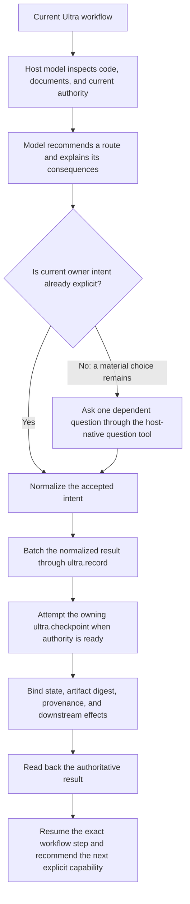
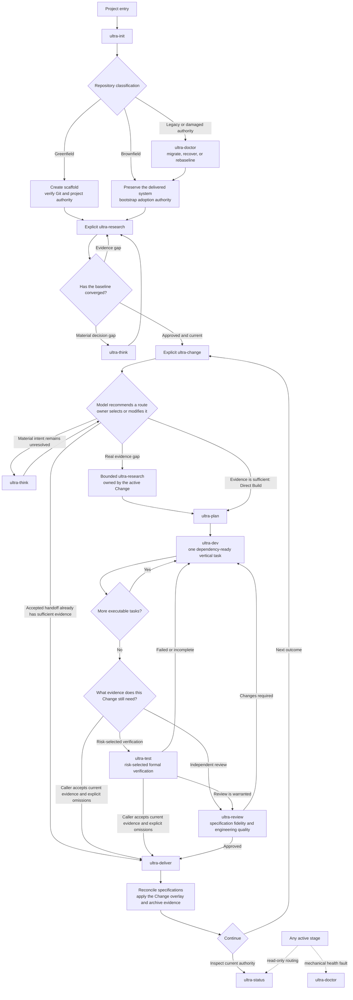

# Ultra Builder Pro

**An adaptive delivery harness for AI coding agents.**

Ultra Builder Pro helps Claude Code, Codex, OpenCode, Kimi Code, and Grok Build
carry a software project from an unclear request to a verified, recoverable delivery.
It keeps the user and the agent aligned, preserves project authority across
sessions, and prevents specifications from quietly drifting away from the code.

It is not another model and it is not a rigid step-by-step autopilot. The active
host agent still investigates, reasons, recommends, and implements. Ultra adds
the durable workflow state, evidence gates, recovery paths, and host-native
tools needed to make that work dependable over time.

<div align="center">

[](https://www.npmjs.com/package/ultra-builder-pro-cli)
[](#development-and-verification)
[](./LICENSE)
[](./package.json)

</div>

## Why it exists

AI coding works well inside one conversation. Real projects last much longer.
After several sessions, teams commonly find that:

- the agent no longer knows which decisions are authoritative;
- implementation changed but product and architecture documents did not;
- a new session repeats research or asks the same questions again;
- an existing codebase is treated like a blank new product;
- a rigid workflow blocks reasonable work, while an unstructured workflow loses
  traceability;
- “tests passed” or “work completed” cannot be tied back to the exact change,
  task, commit, and acceptance criteria.

Ultra Builder Pro addresses those gaps with four ideas:

1. **Adaptive workflow, not a fixed pipeline.** MCP exposes valid capabilities
   and hard recovery requirements. The host model recommends the next semantic
   action from the user's goal and current evidence.
2. **Low-load user alignment.** The agent investigates observable facts itself
   and asks the user only for material intent, scope, risk, or authorization
   decisions—normally one dependent decision at a time.
3. **Durable project authority.** `.ultra/.runtime/state.db` records checkout-local
   lifecycle facts, decisions, checkpoints, evidence digests, sessions, incidents, and
   recovery state across host sessions. Tracked semantic artifacts plus the
   MCP-published `.ultra/tasks/tasks.json` checkpoint carry reviewed project intent
   across Git checkouts without committing SQLite, leases, or telemetry.
4. **Adaptive delivery.** The host model evaluates the evidence produced by the
   actual Change route, explicitly records any omitted capability and its rationale,
   and asks the owner to accept the local handoff. MCP validates current managed
   authority and archive integrity rather than requiring a fixed stage sequence.

For example, if the user asks an agent to add organization SSO to an existing
application, Ultra helps the agent inspect the real authentication path, capture
the intended compatibility and recovery contract, ask only the unresolved
product decision, plan and implement against current evidence, update affected
specifications, and preserve the exact verification and review result. A later
session resumes from that authority instead of reconstructing it from chat.

## The mental model



The responsibility split is deliberate:

| Owner | Responsibility |
|---|---|
| **User** | Product intent, semantic route selection, material scope and trade-offs, risk acceptance, destructive actions, publishing and deployment authorization |
| **Host model** | Fact-finding, synthesis, research-coverage and route recommendations, reversible implementation decisions |
| **Ultra MCP** | Structure/current-byte validation, caller-declared checkpoints, evidence references, digests, team sync, leases, archive transactions, and mechanical recovery; never semantic completeness or route selection |
| **Host adapter** | Native Skill discovery, user questions, tool invocation, installation, and runtime wiring |
| **Hooks** | Fast lifecycle observation, current breadcrumb injection, and protection of MCP-owned checkpoint and generated projection paths |

The MCP does not replace the model's judgment, judge completion, or pre-authorize a
semantic route. It reports diagnostics and safely commits the model's explicit
checkpoint/archive handoff. A hook does not decide product strategy. A prompt does not
become durable authority merely because it appeared in a conversation.

### The seven-tool MCP kernel

The public model-facing surface is intentionally small:

| Tool | Responsibility |
|---|---|
| `ultra.context` | Read the complete current spine without side effects |
| `ultra.record` | Batch typed draft facts and events with idempotency |
| `ultra.checkpoint` | Commit one caller-declared stage checkpoint after structural, byte, digest, and publication validation |
| `ultra.sync` | Inspect, import, or publish the Git team checkpoint |
| `ultra.session` | Own the transactional execution lease |
| `ultra.archive` | Persist one explicit local delivery handoff through the recoverable filesystem/DB boundary |
| `ultra.doctor` | Inspect or repair mechanical health, backup first |

Retired fine-grained operation names are neither discoverable nor callable. Workflow
prose stays in Skills, model judgment stays with the host, and SQLite records what
happened rather than deciding what the model is allowed to think next.

Rejected semantic attempts remain visible as bounded `ultra_kernel_attempt` audit
diagnostics in the next `ultra.context`; they do not create rejected authority.
`_ultra.projection_commit` describes only generated-view processing, never semantic
acceptance. The production Change API has no legacy/current mode switch.

The enforcement gradient is:

```text
exploration and iteration: advisory
durable semantic checkpoint: validated and recoverable
corruption / unsafe path / real concurrency / permission: fail closed
irreversible external effect: explicit owner authority plus fail closed
```

### How owner intent becomes durable authority



The interaction before the write establishes owner intent. Once the host model
normalizes and persists that intent, MCP treats the stored result as current
authority; it does not try to prove that the owner clicked a particular UI
control. Ultra stores the accepted result and its scope, evidence, provenance,
and effects—not chain-of-thought, raw prompts, transcripts, or UI receipts.

## What you get

- Native plugins for **Claude Code**, **OpenCode**, **Codex**, **Kimi Code**, and
  **Grok Build**.
- One workflow vocabulary across all five hosts.
- Deterministic initialization for new, existing, monorepo, and older Ultra
  projects.
- Evidence-backed greenfield research and brownfield adoption.
- A durable Change Contract for every ongoing feature, fix, refactor, or
  incident.
- Context compilation that detects stale plans, tasks, references, and
  specifications.
- Risk-selected testing and independent specification/engineering review.
- Crash-safe sessions, worktree recovery, circuit breakers, and backup-first
  state migration.
- Read-only installation and project diagnostics.
- Optional dependency-wave worker orchestration for already-approved plans.

## When to use it

Ultra Builder Pro is useful when:

- a project will span multiple agent sessions;
- more than one supported host may work on the same repository;
- product or architecture specifications must stay synchronized with delivery;
- an existing codebase needs a trustworthy baseline before new changes;
- failures must be diagnosable and recoverable;
- user decisions, agent reasoning, and mechanical enforcement need clear
  boundaries.

It is probably unnecessary for a disposable one-file experiment or a change
that does not need durable project context.

## Install

Requirements:

- Node.js 22 or newer;
- Git for the normal project workflow;
- Python 3 on a POSIX platform with `dir_fd` filesystem operations for
  inode-pinned archive finalization and recovery;
- one or more supported coding-agent hosts.

Install globally into all detected host configuration directories:

```bash
npx --yes ultra-builder-pro-cli@latest --all --global
```

Or install only one host:

```bash
npx --yes ultra-builder-pro-cli@latest --claude --global
npx --yes ultra-builder-pro-cli@latest --opencode --global
npx --yes ultra-builder-pro-cli@latest --codex --global
npx --yes ultra-builder-pro-cli@latest --kimi --global
npx --yes ultra-builder-pro-cli@latest --grok --global
```

Use `--local` instead of `--global` to install into the current project's host
configuration:

```bash
npx --yes ultra-builder-pro-cli@latest --all --local
```

Verify the installation without changing it:

```bash
npx --yes ultra-builder-pro-cli@latest --all --global --doctor
npx --yes ultra-builder-pro-cli@latest --all --global --doctor --json
```

After installing or upgrading, start a new Claude Code, OpenCode, or Codex
session. In Kimi Code, run `/reload` or start a new session.

Plugin installation, update, doctor, and uninstall never mutate durable user
instructions such as `CLAUDE.md` or `AGENTS.md`. Ultra policy stays in the plugin
and becomes active only after an explicit workflow invocation. Existing legacy
Ultra marker blocks in a user handbook are left untouched for the owner to review;
the plugin neither claims nor silently deletes user-authored content.

### Host invocation

| Host | Example |
|---|---|
| Claude Code | `/ultra-builder-pro:ultra-init` |
| OpenCode | `/ultra-init` |
| Codex | `$ultra-builder-pro:ultra-init` |
| Kimi Code | `/ultra-builder-pro:ultra-init` |

The same naming applies to `ultra-research`, `ultra-change`, `ultra-plan`,
`ultra-dev`, `ultra-test`, `ultra-review`, `ultra-deliver`, `ultra-status`,
`ultra-think`, and `ultra-doctor`.

See the
[Runtime Compatibility Matrix](./docs/RUNTIME-COMPAT-MATRIX.md) for exact
host-specific presentation and lifecycle differences.

## How to use it

### 1. Start a new project

From the project root, invoke `ultra-init`.

Initialization:

- identifies the repository root and scope;
- classifies the repository as greenfield, brownfield, or migrated;
- initializes Git when needed;
- creates `.ultra/` and schema 20 project authority;
- verifies that the scaffold and database can be read back;
- completes without silently starting research, creating a commit, adding a
  remote, or pushing anything.

Then explicitly invoke `ultra-research`. For a new product, the agent evaluates
the complete research catalog but executes only the areas that matter. It
resolves observable facts itself and asks for material product decisions as
needed. Once the evidence and specifications are accurate, the user approves
the baseline.

One common full-depth path after baseline approval is:

```text
ultra-change
  -> optional ultra-think or bounded ultra-research
  -> ultra-plan
  -> ultra-dev
  -> risk-selected ultra-test
  -> ultra-review
  -> ultra-deliver
```

Each public workflow is explicitly invoked rather than auto-chained. The example is a
recommended route for a normal implementation Change, not an archive state machine.
Thinking and research coverage are adaptive, verification depth is risk-selected, and
the host may omit or repeat a capability when the actual Change makes that appropriate,
provided the delivery handoff names the omission and its rationale. Any implementation
task still requires a current plan, DB-backed task contract, and role-scoped context.
“Direct Build” skips Research only; it does not bypass Plan, Task, or Context authority
when development is performed.

### 2. Adopt an existing project

Run the same `ultra-init` entry point. Ultra detects delivered-system evidence
such as application source, APIs, persistence, tests, or deployment
configuration and classifies the repository as brownfield.

Brownfield adoption does not ask the agent to invent a new MVP or rewrite the
product story. It builds a current-system baseline from:

- observable code and runtime behavior;
- existing product and architecture documents;
- build, lint, type-check, and test results;
- APIs, data, permissions, integrations, deployment, and recovery seams;
- known failures, documentation drift, technical debt, and unresolved unknowns.

During `ultra-research`, the host model inspects current evidence and recommends
the smallest sufficient route. The owner selects, modifies, delegates, or
defers it through the host-native question surface unless the current request
already resolves the route. The normalized accepted coverage is then stored in
`.ultra/.runtime/state.db`. Every included area receives one explicit disposition:

- `execute` — produce fresh evidence;
- `verify_existing` — validate an existing artifact;
- `reuse` — reuse evidence that is still current;
- `not_applicable` — exclude it with evidence and rationale;
- `deferred` — record the consequence and accepted owner.

The catalog is not a mandatory document set or questionnaire. Omitted areas
   create no workflow rows; an explicit exclusion is recorded only when retaining
   that rationale is useful. MCP validates accepted checkpoints and mechanical
   integrity; it does not store or prove the preceding UI interaction.

Older projection-only Ultra projects are preserved and routed through a
backup-first migration or rebaseline. The first supported checkpoint publication
replaces a v4.4/v4.5 task projection only when its ids and durable fields match
SQLite, after copying its exact bytes to `.ultra/.runtime/backups/task-ledger/`.
Use `ultra-doctor` when initialization reports migration, mismatch, or authority
damage; do not overwrite old state manually.

### 3. Make daily changes

After the baseline is ready, start features, fixes, refactors, and incidents
with `ultra-change`.

`ultra-change` records the accepted outcome, scope, acceptance criteria,
compatibility boundary, recovery strategy, documentation impact, risk profile,
and research disposition. Capturing intent does not automatically start every
downstream workflow.

The host then recommends one valid capability:

- `ultra-think` for a material unresolved decision or diagnosis;
- bounded `ultra-research` for a real evidence gap;
- `ultra-plan` for the required task decomposition and dependency planning boundary;
- `ultra-dev` after the current plan has produced an executable task contract;
- `ultra-status` when the user needs the current authority and available routes;
- `ultra-doctor` when state or installation health is degraded.

Semantic changes invalidate dependent tasks and compiled context. A stale task
cannot be revived by flipping a status flag; its complete execution contract
must be reconciled against the current Change authority.

### 4. Deliver and continue

`ultra-deliver` asks the host model to assess the current managed evidence for the
route the Change actually took. The handoff explicitly records any omitted capability
and its evidence-based rationale; the owner decides whether that semantic packet is
sufficient. MCP then validates paths, digests, reconciliation structure, idempotency,
and recoverability before archiving the local Ultra change authority. It does not
require every Change to pass through a fixed Research/Plan/Dev/Test/Review sequence.

Delivery does **not** grant permission to commit, push, publish, tag, deploy, or
perform another external effect. Those actions remain separate and require the
user's explicit request.

The next piece of daily work starts with a new `ultra-change`.

## Core workflows

| Workflow | Purpose |
|---|---|
| `ultra-init` | Classify the repository and create or recover project authority |
| `ultra-research` | Build or refresh an evidence-backed baseline with adaptive coverage |
| `ultra-think` | Resolve one material decision or perform bounded diagnosis |
| `ultra-change` | Capture the durable contract for one feature, fix, refactor, or incident |
| `ultra-plan` | Create current task contracts, dependencies, acceptance coverage, and execution context |
| `ultra-dev` | Implement one owned vertical slice and record exact evidence |
| `ultra-test` | Run the risk-selected verification profile and persist the gate result |
| `ultra-review` | Coordinate independent specification-fidelity and engineering review |
| `ultra-deliver` | Reconcile specifications, close local authority, and archive the change |
| `ultra-status` | Read the current context, warnings, blockers, and evidence |
| `ultra-doctor` | Diagnose installation or project-state faults and expose safe recovery |

These eleven capabilities are the complete public Ultra command graph. The host model
recommends the next capability from current context and owner intent; SQLite does not
encode the semantic route. Another public capability starts only after an explicit
user command or skill invocation.

Review and debug agents are evidence-only workers. They may inspect the assigned
checkout and write their declared report, but they never edit source or commit
authority. The primary host evaluates the evidence, applies any repair, and records
the verified outcome.

### Command interaction graph

Every solid handoff below means: the current capability returns context and checkpoint
diagnostics, the model recommends a route, and the owner explicitly invokes the next
public capability. It does not mean that one public command silently launches another.



“Direct Build” skips additional Research only. It still requires
`ultra-plan`, current DB-backed task contracts, dependency ownership, and an
immutable role-scoped Context Manifest before `ultra-dev`. `ultra-status` is a
read-only side route, while `ultra-doctor` diagnoses and repairs mechanical
health without selecting product intent.

## What lives in `.ultra/`

```text
.ultra/
  .runtime/                # local mutable state; ignored by Git
    state.db               # facts, indexes, checkpoints, leases, CAS, and recovery
    checkpoint.json        # advisory recovery projection
    projections/           # generated local task and task-context views
    backups/               # verified migration and recovery snapshots
    collab/                # local collaboration scratch
    sessions/              # local leases and session runtime
    worktrees/             # registered local Git worktrees
    telemetry/             # local operational telemetry
  specs/                   # digest-bound product and architecture baseline
  decisions/baseline/      # normalized accepted baseline decisions
  changes/
    active/<id>/           # all current Change semantics and evidence
      intent.md            # accepted Change Contract
      decisions/           # normalized accepted Change decisions
      progress.md          # generated human-readable projection
      research/            # Change-only findings and research reports
      delta/               # typed baseline overlay and semantic payloads
      documentation/       # documentation overlay and reconciliation evidence
      plan.json            # machine-readable task topology
      plan.md              # deterministic human plan projection
      contexts/            # immutable canonical Context Envelopes
      test/                # Change-scoped test reports
      review/              # Change-scoped review workers and summary
      delivery/            # Change-scoped delivery evidence
    archive/               # immutable delivered Change artifacts
  docs/research/           # baseline-only research evidence
  reports/templates/       # blank report schemas; never delivery evidence
  tasks/
    tasks.json             # MCP-published Git team checkpoint; never hand-edited
  templates/
    task-context.md        # authored template, not a generated task context
```

Together, `.ultra/` is Ultra's project-local cross-session workflow memory. The
host model writes semantic specifications and evidence through the active
capability. MCP records lifecycle state, references, digests, provenance, and
accepted intent, then validates durable checkpoints and mechanical integrity. The DB is the
lifecycle and index authority for one checkout; registered digest-bound files carry
the semantic or evidence bodies that the DB references. The Git checkpoint is a
portable, digest-chained handoff of baseline, Change, and durable task records. It is
not a second live session authority. Generated projections and working scratch are
not authority.

Ultra does not store chain-of-thought, raw prompts, transcripts, general
conversational or episodic memory, or code-graph payloads. External memory and
graph systems remain separate providers; Ultra may store bounded metadata
references to them as workflow context. Only `.ultra/.runtime/` is ignored by
Git: semantic and evidence artifacts can travel with the repository, while
SQLite, leases, telemetry, and recovery scratch remain checkout-local.

### Team checkpoint protocol

MCP publishes `.ultra/tasks/tasks.json` at durable boundaries: baseline convergence,
Change creation or revision, accepted plan export, durable task-contract or status
changes, task expansion or deletion, and Change convergence or archive. The file
contains per-record revisions and digests plus checkpoint ancestry. It excludes
`in_progress` ownership, session ids, leases, worktrees, telemetry, and
`completion_commit`.

After a pull or on a fresh checkout, MCP validates and imports the checkpoint. Clean
records fast-forward independently. A baseline imported as `ready` is downgraded to
checkout-local revalidation until its scope, files, verification, and HEAD are proven
again. Concurrent edits to the same baseline, Change, or task, a non-descendant
checkpoint, or remote modification of an active local task fail with a typed conflict;
Ultra never silently picks a side. Re-importing the same checkpoint is read-only, and
an imported ready baseline cannot publish another checkpoint until local revalidation
converges.

Baseline freshness does not use the checkpoint commit as a self-referential marker.
It combines Git ancestry with a scoped content digest that excludes `.ultra/`.
Consequently, a commit containing only Ultra metadata does not make the baseline stale,
while a descendant commit that changes scoped application content does.

See [Artifact authority](./docs/ARTIFACT-AUTHORITY.md) for the promotion and
evidence rules.

## Optional orchestration

The normal workflow can be driven interactively by the host agent. For an
already-approved plan, `ubp-orchestrator` can dispatch dependency-ready tasks
into isolated Git worktrees:

```bash
ubp-orchestrator execute-plan
```

The orchestrator is intentionally not a replacement for Ultra gates. A worker
process exiting successfully does not complete a task. Task evidence, current
dev state, testing, review, integration, and baseline reconciliation still have
to converge. Worktrees with uncommitted or unintegrated work are preserved for
recovery.

See [Architecture](./docs/ARCHITECTURE.md) and
[Workflow Lifecycle](./docs/WORKFLOW-LIFECYCLE.md) before enabling automated
worker execution or verified auto-merge.

## CLI utilities

| Binary | Purpose |
|---|---|
| `ultra-builder-pro-cli` / `ubp` | Install, update, uninstall, and diagnose host plugins |
| `ultra-tools` | Inspect and maintain project tasks, sessions, state, migration, and recovery |
| `ubp-orchestrator` | Execute current dependency waves or supervise configured workers |

Useful read-only checks:

```bash
ultra-tools status
ultra-tools status --cost --since 24h
ultra-tools session list --json
ultra-tools system doctor
```

Ultra MCP does not require `ANTHROPIC_API_KEY`, `OPENAI_API_KEY`, or another
model-provider key. It validates and persists structures derived by the active
host's existing model session.

## Troubleshooting

- **Installed workflows are missing:** start a new host session. Kimi users can
  run `/reload`.
- **An installed Hook or MCP path is stale:** run
  `npx --yes ultra-builder-pro-cli@latest --all --global --doctor --json`, then
  reinstall only the degraded host.
- **Project state is unhealthy:** invoke `ultra-doctor` or run
  `ultra-tools system doctor`. Repairs and schema migrations are backup-first.
- **The team checkpoint disagrees with local state:** run `ultra-status`, inspect the
  typed ledger condition, then use `ultra.sync` to import or publish after reviewing
  any real conflict. Never edit `.ultra/tasks/tasks.json` by hand.
- **A generated view disagrees with MCP:** trust `.ultra/.runtime/state.db`; never edit
  `.ultra/.runtime/projections/` by hand.
- **A draft checkpoint reports warnings:** the model keeps them visible and decides
  whether to investigate, revise, defer with rationale, or accept. If a checkpoint is
  rejected for a structural, digest, path, publication, or concurrency conflict, fix
  the same mutable draft and retry; no hidden workflow state must be cancelled first.
- **Kimi reports a native-module ABI error:** ensure an external Node.js 22+
  executable is available on `PATH`; the generated Kimi MCP launcher uses
  `env node`.

For exact recovery commands and invariants, see
[Workflow Lifecycle](./docs/WORKFLOW-LIFECYCLE.md) and
[State DB Access Policy](./docs/STATE-DB-ACCESS-POLICY.md).

## Development and verification

```bash
npm install
npm run test:all
npm run test:hooks
npm audit --omit=dev --audit-level=high

# Complete release gate
npm run verify:release
```

Individual Node suites are available as `test:state`, `test:orch`, `test:spec`,
and `test:rest`.

## Documentation

| Document | Purpose |
|---|---|
| [Architecture](./docs/ARCHITECTURE.md) | Components, authority boundaries, and live integration paths |
| [Workflow Lifecycle](./docs/WORKFLOW-LIFECYCLE.md) | Command ownership, transitions, invalidation, recovery, and convergence |
| [Runtime Compatibility Matrix](./docs/RUNTIME-COMPAT-MATRIX.md) | Claude Code, OpenCode, Codex, Kimi Code, and Grok Build presentation details |
| [Legacy CLI Crosswalk](./docs/LEGACY-CLI-CROSSWALK.md) | What was preserved, strengthened, or replaced from the original Ultra Builder Pro |
| [Agent Context](./docs/AGENT-CONTEXT.md) | Context Manifest and host-agent execution contract |
| [Plugin Isolation Contract](./docs/PLUGIN-ISOLATION-CONTRACT.md) | Plugin ownership, explicit activation, idle behavior, and user-instruction isolation |
| [State DB Access Policy](./docs/STATE-DB-ACCESS-POLICY.md) | Multi-process authority and write rules |
| [Roadmap](./docs/ROADMAP.md) | Current and historical delivery scope |
| [Changelog](./CHANGELOG.md) | Release history |

## License

MIT — see [LICENSE](./LICENSE).
