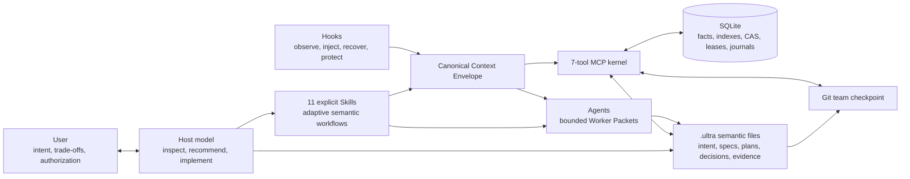

# Ultra Builder Pro architecture

Ultra Builder Pro is an adaptive delivery harness distributed as native plugins for
Claude Code, Codex, OpenCode, Kimi Code, and Grok Build. The host model reasons and
chooses semantic routes. Ultra preserves the accepted intent, current evidence, safe
execution state, and recoverable delivery history across sessions and hosts.

## One authority graph



There is no second semantic authority:

- Skills own recommendations, conditional procedure, and the meaning of completion.
- The host model owns evidence synthesis and reversible implementation choices.
- The user owns goals, material trade-offs, risk acceptance, and external effects.
- MCP owns structure validation, idempotency, digests, CAS, leases, safe paths,
  filesystem journals, recovery, and accepted checkpoints.
- Hooks own deterministic observation and bounded injection only.
- Agents receive one immutable Worker Packet and write only the declared evidence
  output; the primary host owns every source change and final judgment.

SQLite never chooses the next capability and never requires a fixed sequence of
reasoning steps. Semantic gaps appear in `diagnostics`, `warnings`, or
`needs_attention`; hard errors are reserved for corrupt authority, unsafe paths,
real concurrency conflicts, missing runtime prerequisites, permissions, and
irreversible external effects.

## Public MCP kernel

Every host discovers exactly seven tools:

| Tool | Contract |
|---|---|
| `ultra.context` | Side-effect-free, bounded Context Envelope read |
| `ultra.record` | Typed, idempotent recording of facts, decisions, artifacts, tasks, outcomes, and observations |
| `ultra.checkpoint` | Caller-declared Stage Checkpoint with structural, scope, byte, digest, and publication validation |
| `ultra.sync` | Inspect, migrate, import, or publish the Git team checkpoint |
| `ultra.session` | Lease/worktree acquisition plus immutable Worker Packet handoff |
| `ultra.archive` | Crash-safe caller-declared local handoff and immutable archive |
| `ultra.doctor` | Mechanical diagnosis and backup-first repair |

Retired fine-grained tool names are not registered and return `UNKNOWN_TOOL`. The
source repository retains migration readers, an explicitly named internal Change
compatibility implementation, and regression fixtures for old authority. The
production Change facade exposes one Kernel behavior with no mode flag; retired
semantic supervisors are excluded from the npm distribution and no public call can
write their workflow/dialogue authority.

## Canonical Context Envelope

One generator supplies MCP reads, Hook breadcrumbs, compact recovery, Session handoff,
and review/debug Workers:

```text
UltraContextEnvelope
├── project and host identity
├── Git head, branch, scope digest, and drift class
├── accepted baseline and evidence references
├── active Change contract and diagnostics
├── selected Task contract and dependencies
├── accepted normalized Decision Records
├── typed evidence references and freshness
├── execution lease, worktree, and Worker Packet
└── warnings, needs_attention, and hard_conflicts
```

Summary output is bounded to 16 KiB. A selected stage-scoped full envelope is bounded
to 64 KiB. Large bodies remain lazy file references. Identical authority inputs reuse
the same content-addressed snapshot and digest.

## Durable records

### Decision Records

The host first inspects evidence, recommends a route, and asks one material question
only when current user intent does not already answer it. `ultra.record` persists the
normalized question, recommendation, selected result, effects, non-goals, provenance,
applied references, digest, status, and supersession link. It never stores raw
transcripts, prompts, chain-of-thought, or UI receipts.

Decision artifacts are team-visible:

```text
.ultra/decisions/baseline/<decision-id>.json
.ultra/changes/active/<change-id>/decisions/<decision-id>.json
```

### Stage Checkpoints

Each semantic stage has an editable draft. Acceptance creates an immutable revision.
A later accepted revision supersedes the prior one without erasing history:

```text
draft N -> accepted N -> superseded by accepted N+1
```

There is no fixed step authorization table. Skills decide which evidence is relevant
and whether the actual work is semantically sufficient. Checkpoint validation verifies
declared facts, files, digests, scope, idempotency, and safe publication. Semantic
warnings remain recorded but do not prevent an explicit caller acceptance; a hard
authority conflict leaves the draft mutable.

### Worker Packets

Every delegated worker receives a digest-bound packet containing the exact Context
Envelope, accepted decisions, Git boundary, Task contract, acceptance, evidence
references, output path, and output schema. The worker must echo `packet_digest`.
Workers do not write SQLite or accept their own result.
Review and debug workers do not edit source; their only mutation is the assigned
evidence artifact, and the primary host applies any accepted remediation.

### Rejected attempts and projection metadata

Semantic diagnostics do not disappear when a caller corrects and retries. A rejected
public call appends an `ultra_kernel_attempt` event containing the typed operation,
scope, idempotency key, blockers, and diagnostics without storing raw prompts or
creating the rejected semantic row. `ultra.context` exposes a bounded recent view of
that audit history alongside, but outside the digest-bound semantic envelope.

Server metadata uses `_ultra.projection_commit` only for the deterministic
post-mutation projection job. It must never be interpreted as proof that a semantic
record, checkpoint, or archive was accepted.

## `.ultra` storage planes

```text
.ultra/
├── specs/                              # tracked baseline semantic authority
├── decisions/baseline/                 # tracked normalized decisions
├── docs/research/                      # tracked research evidence
├── changes/
│   ├── active/<change-id>/
│   │   ├── intent.md
│   │   ├── diagnosis.md                # incident only
│   │   ├── decisions/
│   │   ├── research/
│   │   ├── delta/
│   │   ├── plan.json
│   │   ├── plan.md
│   │   ├── contexts/
│   │   ├── test/
│   │   ├── review/
│   │   ├── documentation/
│   │   └── delivery/
│   └── archive/                        # immutable self-contained deliveries
├── tasks/tasks.json                    # tracked digest-chained team checkpoint
├── reports/templates/                  # fixed schemas/templates
└── .runtime/                           # ignored checkout-local state
    ├── state.db[-wal|-shm]
    ├── projections/
    ├── sessions/
    ├── worktrees/
    ├── recovery/
    ├── backups/
    ├── telemetry/
    ├── debug/
    └── collab/
```

Tracked Markdown and JSON carry inspectable semantic bodies and evidence. SQLite
stores their typed ownership, digest, references, freshness, and mechanical state.
The team checkpoint carries portable baseline, Change, Decision summary/reference,
Task contracts, dependencies, accepted Stage Checkpoints, and durable outcomes. It
excludes leases, PIDs, worktrees, telemetry, local `in_progress` ownership, and
completion commit backfill.

## Host boundary

| Host | Native plugin surface | Context truth |
|---|---|---|
| Claude Code | plugin commands, Skills, agents, hooks, MCP | SessionStart breadcrumb plus Skill-entry full read |
| Codex | namespaced Skills, TOML agents, native hooks, MCP | session/prompt breadcrumb plus Skill-entry full read |
| OpenCode | command bundle, native agents, JavaScript events, MCP | system transform plus Skill-entry full read |
| Kimi Code | managed plugin commands, Skills, native hooks, MCP | native event breadcrumb plus Skill-entry full read |
| Grok Build | plugin Skills, commands, agents, camelCase hooks, MCP | Skill entry is authoritative; ignored hook stdout is never claimed as injection |

Adapters translate host-native questions and lifecycle events. They never own semantic
selection or durable state. Unsupported host lifecycle surfaces are described as
degraded, not emulated dishonestly.

## Native runtime and installation

The MCP runtime externalizes `better-sqlite3` and installs its JavaScript package plus
the exact native `.node` binary. Provenance records platform, architecture, Node ABI,
runtime command, asset digests, and native digest. Launchers resolve a stable Node
executable and reject ABI drift before opening project authority.

Each host installation uses staging, the final host command for preflight, and atomic
swap. Preflight verifies initialization, exactly seven tools, a public write/read,
Doctor backup, close/reopen consistency, and no project initialization from
`tools/list`. A failed update preserves the previous installation.

## Recovery and migration

`ultra.sync` owns semantic migration. `ultra.doctor` calls the same migration service
for mechanical repair and does not make semantic conflict choices. Supported inputs
include v4.4/v4.5 task projections, the legacy root-level state database, legacy Task
Contexts, and v0.22/v0.23 database and ledger authority.

Migration is inspectable, exact-byte backup-first, transactional, and fail-closed on
conflict. Old workflow and dialogue rows are retained as non-authoritative history;
current Context, Decisions, Checkpoints, and the team ledger are rebuilt from verified
facts. Current artifact invalidation may traverse legacy graph edges to reach a live
Task, but it never rewrites the legacy workflow row. No user should edit SQLite or move
a legacy file manually to recover.

## External boundaries

Ultra does not own general conversational memory, prompt capture, transcript capture,
code-graph payloads, browser automation, deployment providers, framework guidance, or
global engineering policy. Those belong to independent providers or host/user
instruction files. Ultra may store only bounded provider references needed by an
accepted project checkpoint.
