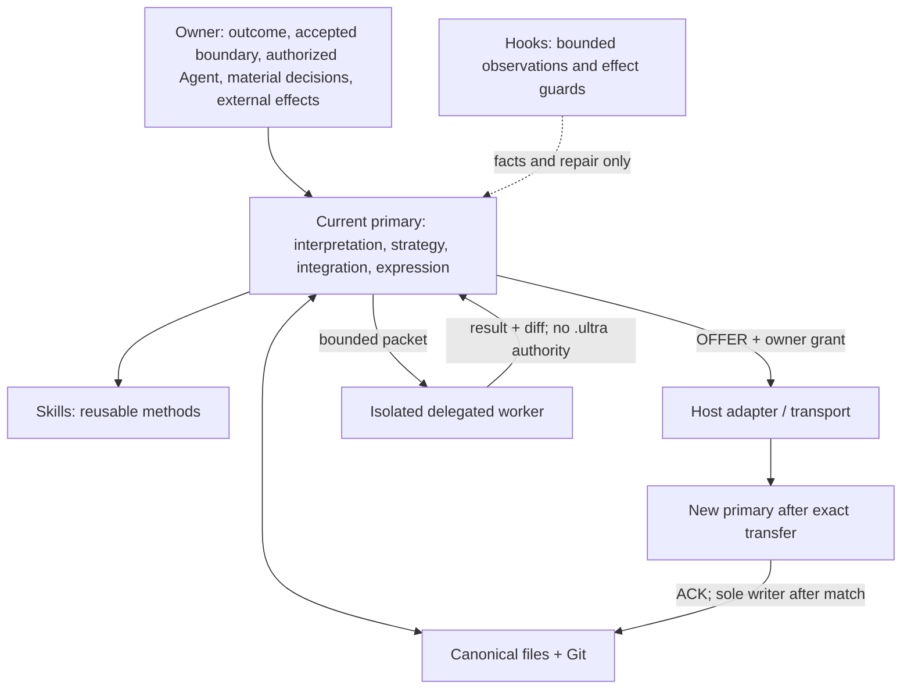

# Ultra Builder Pro 3.0 North Star r3

> **状态**：`owner-directed final design — canonical projection pending`
> **日期**：`2026-08-17`
> **基线 commit**：`9a759003aa77d1a88e1275d70d2c887ee05da993`
> **当前 canonical authority**：`.ultra/north-star.md` revision `north-star-v2-r2`
> **本轮实施者**：ZCode sole writer；Codex read-only reviewer
> **目的**：收敛 Ultra Builder Pro 3.0 的最终 North Star，并定义四个当前 Agent 之间可验证、可恢复的上下文与任务交接
> **effect 边界**：本文件授权本地 repository implementation 和验证，不授权 commit、push、tag、publish、deploy、真实全局安装、credential、production、付费或其他外部/不可逆 effect

## 0. 为什么需要 r3

Ultra Builder Pro 3.0 的实现核心已经提交，但先前 r3 草案仍把 owner 选择一个或多个 Agent、
Codex Multi-Agent、Host-native subagent 和 optional Graph/Loop control plane 混入 North Star。
这是层级错误：它们都是某个版本、Host 或 work package 的执行能力，不是 Ultra 存在的根本目的。

本轮修订解决三个问题：

1. 把 North Star 收敛为 owner–Agent cognitive alignment、真实交付、file-first authority、
   model agency、bounded effects、evidence、recovery 和 terminal work package；
2. 把 Agent 数量、角色、provider、CLI、A2A、Computer Use 和 review 次数下沉到 versioned
   product、work-package grant 或 transport contract；
3. 区分 `primary transfer` 与 `delegated worker`，补齐 ZCode Desktop 作为新 primary 时的
   authority、context、ACK、stale/revoked recovery 和交回边界。

本文件不是第二份 current truth。在 r3 projection 原子完成前，r2 仍是 canonical North Star。
实施不得覆盖历史 r2 decision、snapshot、evidence 或 Review receipts；新 revision 使用新 identity。

## 1. 一句话 North Star

> **Ultra Builder Pro 是一套 provider-neutral、file-first 的真实软件工程 Harness。它让 owner 与当前获授权的 Agent，在每个 work package 内始终基于同一组 owner-readable、Git-bound 的权威事实，对齐为什么做、接受的结果、授权边界、当前现实、证据、未完成和下一步。Owner 保留目标、material trade-off、风险接受和外部/不可逆 effect authority；模型保留理解、分解、策略、语义完整性、证据解释和最终表达；Harness 只机械化身份、可验证事实、权限、effect、协议安全、证据与恢复。工作包必须真实交付，或在不能自动延长的边界内进入明确、可恢复的终态；不得以 finding 数、测试数、轮次、评分、digest 或某个 Host 的内部状态代替产品意义与完成。**

这一定义包含六个结果：

1. **认知对齐**：owner 可以从一个短 checkpoint 理解 why、outcome、boundary、reality、
   risk/not-done、需要的决定和下一步；
2. **真实交付**：完成由 accepted primary user path 端到端成立证明，不由 artifact 数量证明；
3. **Agency 保留**：owner 不被迫逐步遥控模型，模型也不被 counter、regex、score、validator
   或 workflow position 取代语义判断；
4. **有界自动化**：accepted grant 内可以连续执行本地工作，material delta 和未授权 effect
   回到 owner；
5. **可恢复协作**：换 session、Host 或 Agent 后，可以从 canonical files、Git 和必要外部
   evidence 恢复，不依赖隐藏 chat、Host memory 或 daemon；
6. **终止保证**：work package 的预算不能由 Agent、Hook、Reviewer、Goal verifier 或
   control plane 自行延长，并且每个非终态都有 repair、retry、pause、cancel、revoke 或 abandon。

## 2. North Star、Product Contract 与 Transport Contract

### 2.1 North Star constitution

North Star 只保留不应随 provider、版本或实现表面变化的原则：

- owner–Agent cognitive alignment；
- model agency boundary；
- file-first durable authority；
- one semantic fact, one canonical representation；
- explicit grant and separate effect authorization；
- truthful real-path delivery；
- bounded convergence and reachable recovery；
- provider neutrality and honest capability reporting。

North Star 不记录：

- Agent 数量、single/multiple topology 或 reviewer 数量；
- 当前 Host 的名字和数量；
- 当前 Skill、Hook、Adapter 的数量；
- Codex Multi-Agent、subagent、ZCode Goal、LoopX、Graph 或其他 Host feature；
- CLI argv、A2A/ACP/SDK、Computer Use 或 GUI 操作方式；
- 固定三轮、五轮或十轮 Review；
- 测试数量、finding 数量、评分或 package version。

### 2.2 Versioned product contract

Versioned product contract 记录当前 release 真实支持的能力：

- supported Host、interactive surface 和 installation surface；
- Skills、Hooks、Adapters、CLI、Doctor 和 uninstall；
- owner 可以在一个 stage 授权一个或多个 Agent，但未指定时由当前 Agent 单独继续；
- 一个 worktree 的 canonical `.ultra` 同一时刻只有一个 primary writer；
- 其他 Agent 是 read-only reviewer 或 isolated worker，除非 owner 完成 explicit primary transfer；
- transport 的 `declared | documented | verified | supported | experimental` maturity；
- 默认 review budget 和 exact work-package override。

Agent 数量和执行安排在这一层保持 owner-selectable，但 Ultra 不以 decentralized multi-agent
作为默认架构、完成条件或质量指标。

### 2.3 Transport contract

Transport contract 只回答：谁把什么工作交给谁、接收者观察到什么、结果如何回来。

它可以机械绑定：

- repository、Change、task 和 work-package identity；
- source HEAD、worktree digest 和 canonical refs/hashes；
- sender、receiver、role、cwd 和 invocation surface；
- readable/writable scope、allowed tools 和 forbidden effects；
- timeout、cancel、retry、stale/revoked diagnosis；
- output schema、actual diff 和 terminal receipt。

Transport 不决定 goal、acceptance、strategy、quality、finding severity、semantic completion、
merge、delivery 或下一轮工作。

## 3. Agency boundary

| 参与者 | 拥有的决定 | 不拥有的决定 |
|---|---|---|
| Owner | goal、North Star acceptance、material trade-off、risk acceptance、当前获授权的 Agent/role、external/irreversible effect | 不需要逐步指定模型的实现策略 |
| Primary Agent | intent interpretation、decomposition、strategy、semantic completeness、evidence interpretation、priority、integration recommendation、final expression | 不能扩大 grant、替 owner 接受 material delta 或执行未授权 effect |
| Worker Agent | bounded packet 内的 Research、实现、Test 或 Review，以及可验证 result/diff | 不获得新的 product authority，不写 canonical `.ultra`，不 auto-merge/commit/push |
| Harness | identity、authority ingress、schema/protocol、permission、effect gate、physical budget、isolation、receipt、idempotency、recovery | 不决定 meaning、strategy、quality、semantic completion 或最终表达 |
| Hook | bounded observation、context recall、named destructive-effect guard | 不启动 workflow/Agent，不扩大 scope，不改变 finding severity 或 task completion |
| Skill | 一个可复用方法和它的 owner/model boundary | 不拥有整个 process，不自行启动另一个 public workflow，不成为 hidden state machine |
| Adapter | 把共同语义映射到 Host 原生 installation、invocation、permission 和 output surface | 不改写共同语义，不伪造 Host 不存在的能力 |

## 4. 自动化边界

### 4.1 默认与 session-local

Owner 未创建 durable grant 时，当前 Agent 可以在当前会话的 accepted scope 内：

- 读取仓库和必要官方资料；
- 解释意图、制定策略、完成 local reversible work；
- 运行测试和机械验证；
- 在 owner-facing checkpoint 汇报。

它不得从 task status、Resume Note、Hook、progress、历史 Review 或 Host memory 猜测新的 durable
authority。会话授权消失后，未完成工作只能留下 checkpoint，等待新的 owner invocation/grant。

### 4.2 Durable work package

Fresh Agent 跨 session/Host 继续前，必须存在 owner 明确接受的 exact grant，至少绑定：

- repository subject 和 accepted design/outcome；
- included/excluded scope 和 not-done；
- designated primary、reviewer 或 worker role；
- allowed local effects 与 explicit forbidden effects；
- review/repair budget、expiry、revocation 和 invalidation；
- evidence、checkpoint 和 terminal outcomes。

Grant 不是 scheduler、daemon、wake-up service 或无限自治。它不隐含 commit、push、publish、
deploy、真实安装、credential、production mutation、provider spend 或任何其他外部 effect。

### 4.3 Effect

Effect 是模型输出之外的状态变化，包括 repository write、Git mutation、network action、消息、
provider call、purchase、credential/permission change、publish、deploy 和 production data mutation。

- Local reversible file writes 可以由 exact work-package grant 授权；
- commit、push、release、publish、deploy、external message、spend、credential 和 production change
  分别授权、分别执行、分别验证；
- Harness 只对 named effect 和 exact permission 做 mechanical enforcement；
- 描述某个 effect、规划某个 effect 或在文档中提到命令，不等于执行该 effect。

## 5. Single Source of Truth 与 context

Single Source of Truth 不是一个万能文件，而是每项语义事实只有一个 current authority：

| 事实 | Canonical authority | 说明 |
|---|---|---|
| owner 原始目标 | `.ultra/project-brief.md` | 保留原意，不伪装为已验证结论 |
| accepted North Star | `.ultra/north-star.md` | material revision 需 owner 接受并发布新 identity |
| domain language | `CONTEXT.md` | 一个概念一个当前定义 |
| active Change outcome/scope | active Change `intent.md` | 当前 accepted Change |
| execution authority | active Change/decision 中唯一 exact Execution Grant | 不能从 status、Resume 或 chat 推断 |
| task status | `.ultra/tasks.json` | 机械状态，不复制语义判断 |
| task reality/resume | task context 和 closing `## Resume Note` | 当前事实、evidence、not-done 和下一步 |
| command/runtime fact | typed evidence + exact raw ref | observation，不自动形成 semantic verdict |
| Review finding | immutable current receipt | evidence，不自动成为 route 或新任务 |
| external effect | Git/provider/delivery record + owner authorization | 必须分别绑定 |
| current product support | runtime assets + compatibility matrix | versioned fact，不属于 North Star |

Conversation 只携带当前会话解释和 session-local activation；Files 携带 durable authority；Git 携带
bytes、history、identity 和 rollback。Host memory、conversation id、Goal state、progress、cache、index、
packet 和 receipt 都是辅助 observation，不能覆盖 canonical files/Git。

### 5.1 一个 task 为什么不够

`.ultra/tasks.json` 只能表达 task identity、dependency 和 status。可靠交接还必须绑定 accepted
North Star、Change intent、task context/Resume、owner decision/grant、acceptance、not-done、HEAD、
worktree digest、evidence refs、write/effect scope 和 terminal conditions。

Handoff packet 只投影这些 canonical refs/hashes，不复制整段 chat，也不成为第二套 semantic state。

## 6. 两种不可混淆的 Agent 交接

### 6.1 Primary transfer

Primary transfer 适用于“把当前 work package 的实施权交给另一个 Agent”。

最小协议：

1. Sender 把 current reality、evidence、not-done 和下一步写回 canonical task context/Resume；
2. owner 的 durable grant 精确指定 new primary、scope、effects、budget、stop/revoke 条件；
3. sender 生成 derived `OFFER`，绑定 canonical refs/hashes、HEAD 和 worktree digest；
4. receiver stable-read exact refs，返回 `ACK`：observed hashes、accepted role、ready 或 blocked；
5. 只有 grant 有效且 ACK 匹配后，receiver 才成为唯一 canonical writer；sender 停止写入；
6. receiver 执行、更新 canonical files，最终冻结 diff/evidence/not-done 和 terminal result；
7. reviewer/next primary 从 source 重新捕获事实，不继承 receiver 的 completion narrative；
8. 任一 source、grant、role 或 digest mismatch 都返回 `stale/blocked`，不得自动修 packet 或继续。

Owner decision/grant 和 task context 是 semantic authority。`OFFER`、`ACK`、`RESULT` 可放在
`.ultra/.runtime/handoffs/<id>/`，它们是可重建 receipt；丢失时从 canonical authority 创建 fresh
handoff，绝不重构旧 ACK。

### 6.2 Delegated worker

Delegated worker 适用于 bounded Research、实现切片、Test 或 Review：

- 原 primary 保留 semantic integration 和 canonical `.ultra` write authority；
- worker 在 clean isolated worktree 中运行；
- worker 只能修改 writable roots，不写 `.ultra`，不执行 external effects；
- result schema、actual diff、timeout/cancel 和 failure recovery 可验证；
- primary inspection 后决定 integrate、reject、retry 或 return to owner；
- worker 不能把自己的 finding、test 或 completion 直接写成 project truth。

现有 `ultra-delegate` 继续负责这一模式。不得通过放宽 worker 的 `.ultra` 禁写规则伪造
primary transfer。

## 7. 当前四个 Agent 的 transport 边界

截至 2026-08-17，本轮只讨论 Codex、Claude Code、Kimi Code 和 ZCode Desktop。Codex
Multi-Agent、decentralized multi-agent 和 Host subagent 不在 North Star 或本轮实现范围内。

| Agent/Host | 官方可见能力 | 当前 Ultra maturity | 本轮用途 |
|---|---|---|---|
| Codex | `codex exec`、sandbox、JSON/JSONL、output schema、resume | documented + locally verified；正式支持仍以 compatibility drill 为准 | CLI primary/worker/reviewer transport |
| Claude Code | `claude -p`、allowed tools、JSON/stream JSON、JSON Schema、resume | documented + authenticated drill | CLI primary/worker transport |
| Kimi Code | `kimi -p`、stream-json、session resume；`kimi acp` JSON-RPC stdio | documented + locally verified | CLI worker/primary；ACP 不是共同最低协议 |
| ZCode Desktop | Workspace task、Git/files/terminal/browser、root `AGENTS.md`、local project Memory、Goal | interactive documented；app-bundled CLI/protocol 是 verified-local experimental | 本轮 new primary；bounded worker transport 继续 experimental |

官方资料：

- Codex non-interactive：<https://learn.chatgpt.com/docs/non-interactive-mode>
- Claude Code programmatic/headless：<https://code.claude.com/docs/en/headless>
- Kimi CLI：<https://moonshotai.github.io/kimi-code/en/reference/kimi-command>
- Kimi ACP：<https://moonshotai.github.io/kimi-code/en/reference/kimi-acp.html>
- ZCode Agent/AGENTS/Memory：<https://zcode.z.ai/en/docs/agents>
- ZCode Goal：<https://zcode.z.ai/en/docs/goal>

### 7.1 ZCode 的精确结论

当前本机有 signed ZCode Desktop `3.7.7`。`zcode` 不在 `PATH`，但 App bundle 内存在
`/Applications/ZCode.app/Contents/Resources/glm/zcode.cjs` `0.16.3`，本机 help 暴露 headless
prompt、mode、tool allow/deny、max turns、resume 和 `app-server`。App bundle 还包含 ZCode
Protocol session create/resume/send/stop 等方法。

这些是 verified-local facts，不是 provider 的 public stability promise。ZCode 官方页面当前明确的是
Desktop Agent、Workspace、task、`AGENTS.md`、local Memory 和 Goal；本轮核查未找到公开承诺的
headless CLI、SDK、A2A 或 ZCode Protocol compatibility contract。因此：

- ZCode Desktop interactive primary：`documented`；
- 当前 app-bundled headless worker：`experimental + verified-local`；
- ZCode Protocol：`declared/verified-local research surface`，本轮不集成；
- 不得仅因 binary 存在、help 可见或 smoke exit 0 提升为 `supported`。

ZCode Memory 只在本机、默认关闭、不进 Git，且官方说明目前不能浏览或清除；它不是 portable
context authority。ZCode Goal 每轮会自动验证并在未完成时启动下一轮；它可以是本地执行便利，
但不得成为 Ultra 的 semantic completion oracle、review scheduler 或自动续轮来源。

### 7.2 Transport 选择顺序

对一个 owner-authorized recipient，使用最小、最原生、最可验证的路径：

1. 当前 Agent 直接执行，不需要 transport；
2. 官方 non-interactive CLI/SDK；
3. provider 明确文档化且通过 qualification 的 local protocol；
4. A2A/remote protocol，仅在跨机器、服务化 Agent 或 durable remote messaging 出现真实需求时；
5. Computer Use，仅在 owner 仍选择 GUI-only provider 且没有稳定 machine interface 时作为 fallback。

ZCode Desktop 的 primary handoff 默认使用同一 repository + canonical files + owner-selected task，
不需要 Computer Use 搬运上下文。Transport 只负责启动/交互；最终仍由 Git diff、tests、receipts 和
独立 inspection 验证。

## 8. Review 与修复收敛

不变原则：

- Review 挑战 accepted outcome，不生产 workflow；
- finding 是 evidence，不是 route authority；
- zero-finding 不是 semantic completion；
- P2/P3 不自动修复、不自动创建新任务或 Review；
- delta review 只检查 unresolved blocker 和 affected seams；
- reviewer/contract 自身变化时使用 owner-frozen/external boundary；
- 达到 owner-visible budget 后必须 terminal，不允许自动续轮。

North Star 只要求有限、不能自动延长。精确默认值属于 versioned product contract；exact package
override 属于 owner grant。

本轮 r3 projection 的 owner override 是：

- ZCode 是唯一 implementation writer；Codex 只读审查；
- 总审查上限十轮，目标五轮内完成；
- 只有违反 accepted North Star、primary path correctness、authority/effect boundary、数据安全、
  recovery 或明确 acceptance 的 blocker 才要求下一轮；
- 同一 root 连续三次修复失败时停止 point patching，报告 architecture boundary；
- 没有自动第十一轮，也不因 finding 数不为零继续。

## 9. Skill、Hook 与 Adapter 如何配合

### Skill

- 提供 Research、Plan、Dev、Test、Review、Deliver 等方法；
- 读取 canonical authority，帮助模型解释和行动；
- 可以建议另一个 workflow/Agent，但不能自行授权或启动外部 public workflow；
- 不写 hidden stage marker，不把 checklist 变成 semantic state machine。

### Hook

- 注入有限、可追溯 context，记录 mechanical observation；
- 只 hard-block named destructive effect、authority ingress、protocol safety 或 physical ceiling；
- denial 提供 repair/retry/cancel/abandon；
- 不能选择 Agent、启动 workflow/review、推断 durable activation、改变 severity 或完成 task；
- Hooks disabled 时 file/Git primary path 仍完整可用。

### Adapter

- 适配 Skill discovery、Hook event、permission、CLI argv、install、Doctor 和 output；
- 区分 installation、interactive use、bounded worker 和 primary handoff maturity；
- capability 不存在时报告 limitation 和最便宜替代路径；
- 不用 app-internal binary 冒充 official stable contract；
- 不因为某个 Host 缺能力而削弱共同语义。

## 10. r3 完成定义

### 10.1 Definition projection

- owner-directed r3 文本成为新的 canonical North Star revision；
- 新 decision 和 immutable accepted snapshot 绑定 r3 bytes；
- r2 和历史 evidence 保持 byte-stable history；
- Host/Skill/Hook 数量、Agent arrangement 和 exact budget 从 constitutional layer 移出；
- public docs、specs、Skills、Hooks、Adapters 和 tests 只更新真实 consumer。

### 10.2 Context/handoff closure

- primary transfer 与 delegated worker 有互斥、owner-readable 合同；
- task status 不冒充完整 context；handoff packet 只绑定 canonical refs/hashes；
- one canonical writer invariant 在 offer/ACK/execute/result/revoke 全路径成立；
- stale HEAD/grant/ref、receiver refusal、interrupt/resume、cancel、revocation 和 missing receipt 都有
  reachable terminal/retry；
- current `ultra-delegate` 的 worker least-authority boundary 不被削弱；
- hidden chat、ZCode Memory、Goal、progress 或 Host session id 不成为 shared authority。

### 10.3 Four-Agent operational evidence

- Codex、Claude、Kimi 的 official machine interface 有 source-backed capability record；
- ZCode Desktop interactive 与 app-internal experimental transport 被诚实区分；
- 完成一个 CLI/agent → ZCode Desktop primary transfer drill：sender freeze → ZCode ACK → sole-writer
  implementation → frozen result → Codex read-only recapture；
- 完成一个 ZCode → CLI bounded worker drill；
- Hooks disabled 的 fresh session/Host 仍能从 files + Git 恢复；
- post-seal write、stale packet、worker failure、timeout/cancel 和 owner pause 都有 reachable exit；
- 不需要 Codex Multi-Agent、decentralized orchestration、Graph、LoopX、MCP、daemon 或数据库。

### 10.4 Human–Agent balance

Operational completion 还要求 owner 能从一个 checkpoint 准确回答：

1. 为什么做；
2. accepted outcome 是什么；
3. 当前真实完成/未完成什么；
4. 当前风险、limitation 和 not-done 是什么；
5. 现在需要 owner 决定什么、下一项 bounded action 是什么。

如果 owner 看不懂当前 reality，测试全绿也不算 cognitive alignment。反之，不要求 owner 审批每个
局部实现选择；模型在 grant 内保留策略和表达权。

## 11. ZCode implementation work package

Owner 已授权：先由 Codex 写清本文件，然后由 ZCode 完成所有 implementation，Codex 只读验收。

ZCode 必须从当前 repository facts 出发，自己决定最小实现，但不得改变以下 accepted boundary：

1. 发布 r3 canonical North Star revision、decision 和 immutable snapshot；
2. 更新 active Change/task context，使本包有 exact ZCode sole-writer grant、scope、effects、budget、
   terminal 和 Resume；旧 completed Mode B task 保持历史完成，不伪造重开；
3. 一次性同步真正受影响的 specs、public docs、Skills、Hooks、Adapters、CLI/tests；
4. 删除或下沉 North Star 中的 topology、Codex Multi-Agent、exact Host/Skill/review-number assumptions；
5. 增加 primary transfer 合同和最小 live consumer；优先复用 files、Git、现有 grant/context 和
   delegation primitives，不新增 semantic registry、workflow engine、daemon 或数据库；
6. 保持 `ultra-delegate` 为 bounded worker，禁止通过 worker `.ultra` write 模拟 primary transfer；
7. 将 ZCode app-bundled CLI/protocol 标记 experimental，除非官方 documentation + full recovery
   drill 同时满足 `supported` bar；
8. 加入 behavior/permission/effect/recovery regressions，不用整段 prose regex 代替 semantic design；
9. 用临时 repository 做 primary-transfer stale/revoke/interrupt/cancel/missing-receipt drills，并完成
   一次真实 ZCode primary readback；
10. 跑 narrow tests、package suites、Skill validators、release verify、pack dry-run 和 isolated Doctor；
11. 冻结 changed paths、exact commands/results、fakes、limitations、not-done 和 external-effect report；
12. 不 commit/push/tag/publish/deploy/install 到真实 HOME，不改 credential，不产生新付费 effect。

ZCode 不得因为 implementation 中发现更多可能机制而扩大为 A2A、Graph、Multi-Agent 或 Goal
orchestration。若 files + native Host tools 无法满足 accepted primary path，必须先给出 reproduced
failure 和最小替代方案，由 owner 决定是否扩大。

## 12. 当前事实快照

- HEAD `9a759003aa77d1a88e1275d70d2c887ee05da993`：`feat: implement Ultra Builder Pro 3.0 workflow core`；
- 当前 r2 North Star 仍 canonical，r3 尚未 projection；
- 当前 active Change `chg-ultra-3-0-mode-b` 的旧 task 已 completed；新 r3 projection 必须创建
  新 work-package identity，不改写旧 task completion；
- Claude → Codex file-backed continuation 已真实验证；
- ZCode 作为 bounded target 和 ZCode → Claude source path 已真实验证；
- ZCode Mode B sole-writer 实施已发生，但未形成通用 `OFFER → ACK → primary switch → RESULT` 合同；
- 当前 app-bundled ZCode CLI 可运行，但官方 public interface status 未达到 supported；
- commit、push、release、publish、deploy 和真实安装仍是 separate owner effects。

## 13. Deliberately absent

本轮故意不做：

- Codex Multi-Agent、subagent 或 decentralized multi-agent integration；
- LoopX/Graph control plane；
- A2A server、MCP server、daemon、database、queue 或 lease service；
- 依赖 Host Memory/Goal/chat transcript 的 cross-Agent truth；
- 自动选择 provider、Agent 数量或 reviewer 数量；
- 自动扩展 review/repair budget；
- 以 zero-finding、validator pass、score、digest 或 task count 宣称 semantic completion；
- commit、push、tag、publish、deploy、production、credential 或付费 effect。

未来若真实跨机器/远程 messaging、并发 claim 或 durable scheduling failure 证明 files + Git + native
Host tools 不足，再单独 Research A2A/Graph/LoopX；它们不是 3.0 North Star 的完成前提。
