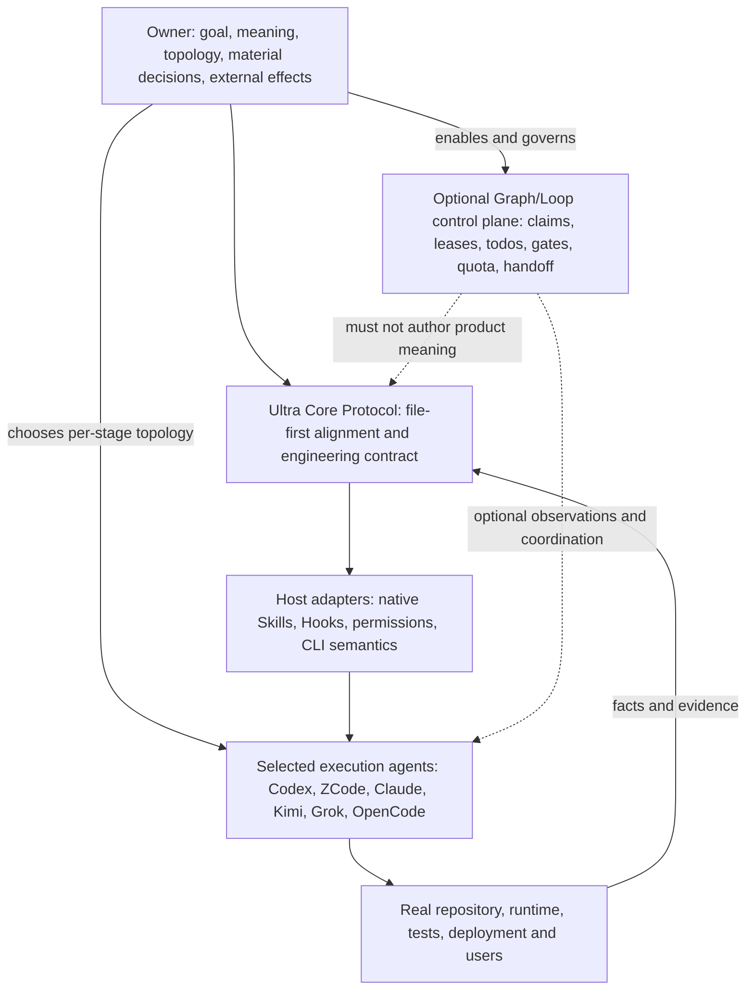
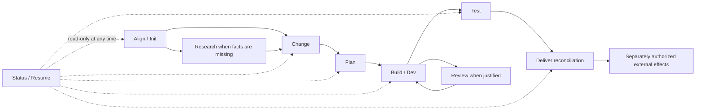
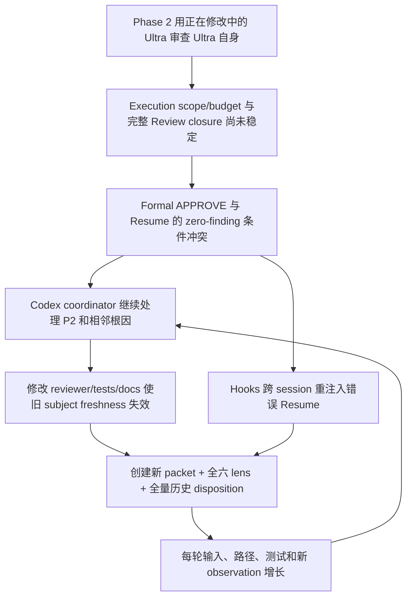

# Ultra Builder Pro 3.0 North Star 与工作流总纲

> **状态**：`accepted forward design — implementation pending`
> **接受日期**：`2026-08-17`
> **目的**：先统一认知与 forward design，再通过独立 owner grant 授权实现
> **当前权限**：本文定义产品与工作流设计；具体执行权限只来自对应的 owner grant，不能从本文、task status、Hook 或 Resume 推断
> **本轮实现责任**：本轮全部代码与仓库实现交给 ZCode；Codex 只做只读检验与验收；未来工作包仍由 owner 逐阶段选择 Agent
> **审查边界**：同一工作包最多三轮 Review；P0/P1 才阻断；P2/P3 只报告，不自动生成下一轮
> **历史边界**：现有 v0.27 文档、Change、task、evidence 和 Review receipt 都是调查输入；本文不是对它们“已经实现”的声明

## 0. 为什么先冻结这一份总纲

当前仓库已经同时存在 North Star、product/architecture spec、生命周期方案、事故复盘、WIP、
task context 和多轮 Review receipt。它们包含大量真实证据，但也包含不同时间点的目标、当前事实、
过渡机制和已经被后续结论取代的规则。

直接同步十几份 canonical 文档会制造第二套事实，并再次进入“为了让所有镜像一致而不断修改”
的循环。因此 3.0 先冻结这一份 forward-design authority：

1. 由掌握完整 owner 对话上下文的 Codex 起草；
2. owner 逐项讨论、修改并于 2026-08-17 明确接受；
3. ZCode 按独立 durable work-package grant 把接受结论一次性投影到 `.ultra/north-star.md`、spec、
   public docs、Skills、Hooks、Adapters、Tests 和实施 Change；
4. 投影完成前，现有 v0.27 operational files 仍描述当前 checkout，本文描述 3.0 的目标设计；两者
   的差异是待迁移工作，不得被伪装成已经完成；
5. 动态实施进度只记录在一个短 WIP 中，不回写本文形成流水账。

这条顺序本身就是 3.0 的第一条实践：**认知对齐先于状态同步，语义接受先于机械验证。**

## 1. 结论先行

### 1.1 一句话 North Star

> **Ultra Builder Pro 的存在目的，是让 owner 与任意被选中的 Agent 在真实软件工程的整个生命周期中，持续对齐“为什么做、要得到什么、已经授权什么、实际发生了什么、下一步是什么”，并在不转移产品意义所有权的前提下，使 Agent 能够交付可运行、可验证、可恢复的真实结果。**

这句话包含五个不可拆开的部分：

1. **认知对齐**：owner 不需要从海量日志中猜 Agent 正在做什么，Agent 也不能从旧文件中猜 owner
   现在授权了什么；
2. **真实交付**：完成是用户结果端到端成立，不是 task 数、finding 数、测试绿灯或流程走完；
3. **可选择执行拓扑**：每个阶段由 owner 决定一个 Agent、多个 Agent、哪个 provider、是否委派；
4. **有界自动化**：自动化覆盖已经接受范围内的执行、事实采集、协议安全和恢复，不覆盖产品意义；
5. **跨会话恢复**：关键事实留在 owner-readable files 与 Git 中，换 Agent、换 Host、压缩上下文后仍能继续。

### 1.2 North Star 不是一句口号，而是五个可观察结果

| ID | 可观察结果 | 验收方式 | 不能冒充成功的代理指标 |
|---|---|---|---|
| `NS-01` | owner 能准确理解当前目标、已接受边界、真实进展、风险、未完成项和下一个需要其决定的事项 | owner 根据简洁 checkpoint 做 `owner-judgment`，并能指出是否存在 material drift | 文档数量、摘要长度、问答轮数 |
| `NS-02` | 任意 owner 选定的 Agent/Host 能仅凭 canonical files、Git 和必要外部证据恢复当前工作，而不依赖隐藏聊天记忆 | fresh-session / cross-host continuation drill | snapshot 数、digest 数、恢复脚本绿灯 |
| `NS-03` | 已接受范围内的 Agent 能完成真实软件的窄垂直切片，live path 不含未披露 mock、stub、伪接口或脱线 scaffolding | 真实 consumer、E2E、runtime observation 与 owner acceptance | 单测数量、代码行数、任务完成百分比 |
| `NS-04` | 所有写入、外部 effect、权限、成本和失败都被约束在 owner 可见且可恢复的边界内 | exact authority/effect evidence、typed diagnostic、retry/cancel/abandon | “Agent 看起来很谨慎”、reviewer 主观保证 |
| `NS-05` | 每个 coherent work package 在最多三轮 Review 内结束为接受、owner 决策、外部阻塞、预算停止或放弃，不存在自动第四轮 | Review chain 和 terminal outcome inspection | zero-finding、所有 P2 修完、历史 finding 全量重放 |

这些结果不是五个独立 KPI。只要 `NS-01` 的认知对齐或 `NS-03` 的真实结果失败，即使其余
机械检查全部通过，也不能宣称 Ultra 成功。

### 1.3 非目标

Ultra Builder Pro 3.0 不试图：

- 替 owner 决定产品目标、价值排序、风险接受或不可逆 trade-off；
- 把模型的战略、语义完整性、架构判断或最终表达编译成状态机；
- 强制 Research、Plan、Dev、Test 或 Review 使用固定数量或固定 provider 的 Agent；
- 通过固定 finding 数、round 数、regex、digest、score 或 timeout 证明“质量足够”；
- 建立 Ultra-owned 通用 memory、code graph、数据库、daemon、MCP kernel 或必选 orchestrator；
- 把 LoopX 或任何 Graph 系统变成产品意义、acceptance 或 workflow truth 的所有者；
- 为了流程完整而创建没有 live consumer 的文档、schema、task、review 或 evidence；
- 在 owner 没有提出长程/多 Agent 协调需求时默认启动后台 orchestration。

## 2. 核心词汇：先统一语言，再设计机制

| 词汇 | 3.0 中的唯一含义 |
|---|---|
| **Owner** | 提供目标、接受 North Star 与 material trade-off、选择 Agent 拓扑、授权外部/不可逆 effect，并保留最终产品意义所有权的人 |
| **Agent** | 在当前授权边界内解释意图、分解问题、选择策略、执行、解释证据并表达结果的模型实例；provider 与角色不是永久绑定 |
| **Host** | 承载 Agent 的原生环境，如 Claude Code、Codex、OpenCode、Kimi Code、Grok Build 或 ZCode |
| **Ultra Core Protocol** | Ultra 的 provider-neutral、file-first 协议核心：认知对齐、per-fact authority、work package/grant、evidence/recovery、checkpoint 与 terminal contract 的最小组合；它不是某个进程、daemon、MCP、数据库、CLI 或固定工作流状态机 |
| **Stage** | 一种能力边界，如 Alignment、Research、Change、Plan、Build、Test、Review、Deliver；不是强制 runtime state |
| **Work package** | 一组具有同一 accepted outcome、scope、evidence 和 terminal rule 的 coherent 工作；不是每个 finding 一个新包 |
| **Canonical fact** | 某个语义或状态事实唯一可修改的 owner-readable 表示；不同事实可以有不同 canonical 文件 |
| **Observation** | 命令输出、Git identity、运行日志、review finding、counter、digest 等输入材料；它不会自行变成语义结论 |
| **Evidence** | 有来源、范围、时间/identity 和限制的 observation，足以支持某个明确 claim，但不替 owner/model 作最终语义判断 |
| **Effect** | 改变工作区、canonical authority、外部系统、成本或不可逆状态的动作 |
| **Grant** | owner 明确给出的执行授权。默认是 session-local；owner 也可以显式签发 durable work-package grant，使后续 Agent 在 exact scope、expiry、invalidation 与 effect 边界内继续。普通 stored quote、task status 或 progress 不能被推断为 grant |
| **Checkpoint** | owner 与 Agent 对 goal、delta、风险、下一步和未完成项进行认知同步的界面，不是机械 stage marker |
| **Topology** | 某个阶段使用多少 Agent、哪些 provider、哪些可写/只读角色以及如何 handoff；由 owner 每阶段选择 |
| **Control plane** | 可选的 claims、leases、todos、gates、quota、attention 和 handoff 机械控制层；它不拥有产品意义 |

## 3. 产品边界：一个协议核心，三层可选能力

### 3.1 Ultra Core Protocol：任何 Host 都必须能独立使用

`Ultra Core Protocol` 指共同工作流协议，不是名为 “Core” 的运行时组件。Skills、owner-readable
files、Git、Host adapters 与可选 Hooks 可以实现或承载其中的不同部分，但任何单一实现都不拥有
协议语义。即使没有 Hooks、CLI、MCP、LoopX、subagent 或后台 scheduler，该协议也必须完成：

- 一次只问一个 material owner 问题；
- 把接受后的目标、边界和决定写入 owner-readable canonical files；
- 形成可执行的 work package、证据要求、恢复路径和 terminal rule；
- 让一个普通 Agent 在单一会话或后续 fresh session 中继续；
- 在结束时清楚报告真实结果、限制、未完成项和下一步 owner 决定。

### 3.2 Host Adapter：适配原生能力，不改写共同语义

Adapter 负责 native invocation、Skill discovery、Hook event、权限表达、headless CLI argv、安装、
Doctor 和限制报告。一个 Host 没有某项能力时，应报告真实 limitation 和最便宜替代路径，不能通过
最低公分母 shim 改写所有 Host，也不能声称不存在的能力已接通。

### 3.3 Optional Graph/Loop control plane：只在协调问题真实出现时启用

可选层可以参考 LoopX，拥有：

- goal/todo identity；
- claim、lease 和 writer ownership；
- attention queue 与 blocker；
- cost/tool/turn quota；
- human gate 记录；
- cross-agent handoff receipt；
- append-only run/effect observations。

它不得拥有：

- North Star、产品 meaning 或 acceptance；
- finding 的语义严重度和最终 disposition；
- architecture、strategy、scope reduction 或 risk acceptance；
- “当前质量足够”的机械 verdict；
- 对未授权 Agent 的自动启动权。

因此 3.0 不是“把 Ultra 改成 LoopX”，而是允许在长程、多 Agent、跨 Host 场景中把 LoopX 作为
外部协调内核。Ultra Core Protocol 本身仍须在纯文件 + Git 上成立。

## 4. 认知对齐协议：先讨论，再写 spec，再执行

### 4.1 对齐循环

对齐不是一次生成长 PRD，而是短循环：

1. Agent 复述当前理解的 outcome 与为什么；
2. 识别一个会 materially 改变结果的未知；
3. 一次只问 owner 一个问题，并给出建议、证据和答案影响；
4. owner 回答后，Agent 更新同一份讨论稿，而不是追加第二份真相；
5. 当剩余未知不再影响 outcome、scope、risk 或 external effect 时，Agent提出可接受版本；
6. owner 明确接受后，才将其写入 canonical authority 并进入 Change/Plan。

仓库、runtime 或官方文档能回答的事实由 Agent 自己调查，不能把可观察问题推回 owner。

### 4.2 Owner checkpoint 的固定语义，而不是固定字数

每个 owner-facing checkpoint 至少回答：

- **Why**：我们解决的真实问题是什么？
- **Outcome**：用户或系统最终会看到什么不同？
- **Accepted boundary**：已经接受了什么，明确没有接受什么？
- **Delta**：自上次 checkpoint 后，事实或计划发生了什么 material 变化？
- **Reality**：目前 live path 真正工作到哪里？哪些仍是 fake、unknown 或 unverified？
- **Decision needed**：owner 现在必须决定什么？如果没有，就不要制造问题；
- **Next bounded action**：当前授权内最小的下一步是什么？
- **Not done**：结束或暂停时还欠什么？

Checkpoint 要足够短，使 owner 能做知情判断，但不使用固定行数、token 数或“覆盖率”作为机械 gate。

### 4.3 对齐失败的处理

如果 owner 表示“我不知道你在做什么”“这不是我想要的”或同一概念反复被重新解释：

- 立即停止执行和 review；
- 回到最近一个 owner 已接受的 outcome；
- 展示当前 delta，而不是继续解释内部流程；
- 删除或降级多余机制；
- 只有在 owner 重新接受后才创建新的 work package。

## 5. Single Source of Truth：不是“一个万能文件”，而是“一项事实一个权威”

### 5.1 权威矩阵

| 事实 | Canonical authority | 允许修改者/能力 | 主要消费者 | 修改条件 |
|---|---|---|---|---|
| 原始需求与 owner 原话 | `.ultra/project-brief.md` | Init/Alignment 在 owner 可见前提下记录 | Research、Change | 保留原意；不得改写成已验证事实 |
| 已接受 North Star、约束、非目标 | `.ultra/north-star.md` | 对齐完成后的 Research/明确 North Star revision | 所有后续阶段 | material 变化必须 owner 再接受 |
| 领域词汇 | `CONTEXT.md` | Domain Modeling / 当前语义编辑者 | 所有 Agent | 一个词一个定义；不放实现计划 |
| 当前 Change 的 outcome/scope/acceptance | `.ultra/changes/active/<change_id>/intent.md` | Change reconciliation | Plan、Build、Test、Deliver | material delta 显示给 owner；stored text 不等于 live activation |
| 当前 work package 的执行授权 | active Change 内唯一 `Execution Grant`（不另建语义镜像） | owner 接受；Plan/Change 只记录 exact grant | executor、handoff、Status | 明确标注 `session-local` 或 `durable`、scope、Agent topology、允许的 local effects、budget/expiry、invalidation 与 revoke；外部 effect 默认不包含 |
| task dependency 与 status | `.ultra/tasks.json` | Plan 创建结构；当前执行者更新 status | Status、Build、Test | 只记录机械 status，不复制语义判断 |
| task 实施上下文、resume、not-done | task context file | 当前唯一 canonical writer | fresh session、review、handoff | Resume 只导航，不能覆盖 acceptance/verdict/scope |
| 命令与外部事实 | typed evidence + exact raw ref | 执行 Agent / Test | Review、Deliver | 绑定实际 subject；失败不自动改语义 |
| Review findings | 当前 immutable Review receipt | read-only reviewer(s) | executor、owner、Test | finding 是 evidence；只有 P0/P1 自动阻断当前包 |
| 发布/部署/外部 effect | provider/Git 的真实记录 + delivery record | owner 授权的 effect executor | Owner、Status | 每种 effect 独立授权与验证 |
| 历史变更 | Git history | owner 授权的 committer | 所有人 | Git 证明 bytes/history，不替代当前产品 meaning |

### 5.2 修改协议

任何 canonical semantic fact 的修改都经过同一窄协议：

1. stable-read 当前权威；
2. 展示语义 delta 和理由；
3. 如果影响 outcome、scope、risk、acceptance 或 external effect，则等待 owner 接受；
4. 由一个 designated writer 更新唯一 canonical representation；
5. readback 验证实际 bytes；
6. 更新必要消费者，不创建 prose mirror；
7. 旧版本由 Git/历史 artifact 保存；当前文件不无限追加历史全文。

### 5.3 Conversation、Files 与 Git 的不同职责

- **Conversation**：当前意图解释、session-local activation、一次性约束和 owner 即时决定；不能作为跨会话唯一证据。
- **Files**：当前 owner-readable meaning、scope、status、evidence link 和 recovery；owner 明确选择 durable automation 时，也承载 exact durable work-package grant。文件必须职责单一，不能从普通 prose/status 推断 grant。
- **Git**：bytes、diff、identity、history 和 recovery point；不能决定某段内容是否仍被 owner 接受。

不存在“把所有聊天内容都落盘”的要求。只记录未来 Agent 恢复和 owner 决策真正需要的 durable fact。

### 5.4 跨会话自动化与双模式 durable grant

3.0 必须同时支持两种合法模式；这是授权持续时间的选择，不是两套产品：

- **模式 A — `session-local`**：默认模式。owner 的授权只在当前对话有效；fresh Agent 读取 files
  了解上下文，但必须重新获得 activation；
- **模式 B — `durable work-package`**：owner 明确要求某个 exact work package 可跨 session/Agent
  继续，并接受一份 exact grant。fresh Agent 可以依赖该 grant，但必须先稳定验证 subject、scope、
  topology、allowed effects、budget、expiry、revocation 和 invalidation；任何 mismatch 都停止并回到 owner。

Durable grant 不能由 Agent 自己创建或扩大，也不默认包含 commit、push、publish、deploy、真实
provider spend 等 external effect。handoff 传递 grant identity，不复制一份新的 authorization prose。
模式 B 不等于 daemon、定时唤醒或无限自治；它只解决“换会话后授权是否仍有效”。Host 是否继续
运行、何时唤醒、由哪个 Agent 接手，仍由 owner 或 owner 明确启用的 control plane 决定。
这样既避免“fresh session 从任务文件猜权限”，又不会让自动化永远被锁在同一个聊天窗口。

## 6. Agent 拓扑：能力必须完整，选择权永远在 owner

### 6.1 每阶段可选，而不是固定编排

| 阶段 | 单 Agent 可行 | 多 Agent 可行 | 默认（owner 未指定） | 可选多 Agent 的真实理由 |
|---|---|---|---|---|
| Alignment / Init | 是 | 是 | 当前 Agent 单独进行 | 不同语言/业务背景需要补充访谈，但不能并行轰炸 owner |
| Research | 是 | 是 | 当前 Agent 单独调查 | 独立证据源、不同技术域、可并行的 primary-source legwork |
| Change / Plan | 是 | 是 | 当前 Agent 单独形成 coherent plan | 复杂公共 seam 需要独立挑战；最终仍由一个语义编辑者合并 |
| Build / Dev | 是 | 是 | 一个 executor、一个 worktree | 真正可隔离的任务、不同技术栈、独立 worktree |
| Test | 是 | 是 | 当前 executor 或 owner 指定 tester | 独立环境、真实设备/provider、跨模块 whole-path |
| Review | 是 | 是 | 一个 reviewer；风险需要时增加 | 独立 blind spot、cross-family probe；不是为了满足 lens 数量 |
| Deliver | 是 | 是 | 一个 coordinator | 不同 effect executor 或独立 rollback 验证 |

Owner 可以在任何阶段明确：

- 使用一个还是多个 Agent；
- 使用 ZCode、Codex、Claude、Kimi、Grok、OpenCode 或其他 provider；
- 哪个 Agent 可写，哪个只读；
- 是否串行、并行、handoff 或停止；
- 是否启用 optional Graph control plane。

这些选择可以是当前 session 的一次性决定，也可以由 owner 写入 exact durable work-package grant；
后者才能被后续 Agent/Host 直接消费，且不会因为 handoff 获得更多权限。

如果 owner 没有指定，Ultra 的默认是：**当前 Agent 单独继续，不自动 spawn、不自动 delegate、
不自动启用 control plane。** Agent 可以提出建议，但建议不是授权。

### 6.2 Provider 与角色不绑定

“ZCode 负责开发、Codex 负责审查”可以是某个 work package 的 owner 决定，但不能成为 Ultra 的
全局设计。下一次工作可以由 Kimi 开发、Claude 审查，也可以由单一 Codex 完成所有阶段。

Ultra 记录的是当前 work package 的角色和权限，不是 provider 的永久身份。

### 6.3 多 Agent 的最小安全条件

多 Agent 只有同时满足以下条件才比单 Agent 更合适：

- 工作可按真实 seam 隔离，而不是人为拆小；
- 每个 Agent 有明确输入、write scope、terminal output 和 consumer；
- canonical semantic artifact 始终只有一个 writer；
- 并行 source write 使用独立 worktree 或 Host 原生隔离；
- handoff 只传当前事实、accepted scope、evidence 和 not-done，不传无限历史；
- 合并由 owner 指定的 coordinator/model 解释，而不是多数票。

## 7. 工作流：能力图，不是必须逐格运行的状态机

### 7.1 Align / Init

- 保存 raw owner intent，不提前生成成功标准；
- 识别当前项目事实与未知；
- 建立或定位 canonical file skeleton；
- 如果这是 micro edit 且不改变任何 accepted semantic statement，允许走普通工程路径。

### 7.2 Research

- 只研究会改变 owner 决策、North Star、public contract 或实施可行性的未知；
- 使用 primary source；
- owner 决定单/多 Agent；
- delegated Research 是 legwork，不是把综合判断外包；
- 结果进入同一讨论稿/accepted baseline，不形成平行 truth。

### 7.3 Change

- 把 accepted North Star 变成一个 observable outcome；
- 明确 non-goals、public seams、risk、acceptance 和 not-done；
- reduction、material expansion、不可逆 trade-off 回到 owner；
- 新请求不会静默塞入当前 Change。

### 7.4 Plan

- 按真实技术 seam 形成最小 tracer-bullet graph；
- owner 可选择执行 Agent/拓扑；
- 每个 task 必须有 live consumer、验证、恢复和完成边界；
- task 数、文件数、行数和 complexity 只能是 observation。

### 7.5 Build / Dev

- 一个 work package 只有一个 canonical writer；
- bug 先 RED，new behavior 先 contract test，refactor 先 characterization；
- 实现从真实入口穿过真实依赖到真实 consumer；
- 不以 fake live boundary 冒充交付；
- 每个暂停点更新 current facts 与 not-done，不自动启动 Review。

### 7.6 Test

- 验证 accepted outcome 与 real path，不只是内部实现；
- 区分 command fact、inspection、owner judgment、external observation；
- 绿色测试不覆盖未执行的 provider、环境或用户路径；
- 测试不能通过机械规则创造产品意义。

### 7.7 Review

- Review 是 challenge/evidence，不是 workflow launcher；
- owner 决定单 reviewer 或多 reviewer；
- risk 和 seam 决定 lens，而不是固定六 lens；
- finding 保留 disagreement，但不以投票决定 meaning；
- 执行第 9 节的三轮收敛合同。

### 7.8 Deliver

- 先对比 accepted outcome 与实际结果；
- 列出 fake、unknown、excluded、residual risk 和 rollback；
- product/docs 发生 material delta 时回到 owner 或 fresh Test，不自动循环；
- commit、push、tag、publish、deploy、install 和 spend 分别授权。

## 8. 自动化边界：自动化事实与 effect，不自动化意义

### 8.1 可以机械化的事实

- 文件存在、类型、大小、identity、bytes 和 digest；
- Git HEAD、diff、tracked/untracked manifest、worktree identity；
- 命令 argv、cwd、timeout、exit code、stdout/stderr ceiling；
- provider/Host capability 和实际 readiness；
- process terminal state、lease、claim、quota consumption；
- exact permission、write scope、resource ceiling；
- schema、protocol、idempotency、atomic write/readback；
- evidence provenance、freshness 和 recovery path 是否存在；
- external effect 是否有当前 owner grant。

### 8.2 必须留给 owner/model 的意义

- 这个功能值不值得做；
- 需求的最佳解释和优先级；
- architecture/strategy 是否合适；
- evidence 是否足以支持 semantic claim；
- acceptance 是否完整、某个缺陷是否真的阻断 outcome；
- P1/P2 的语义严重度与 risk acceptance；
- 多个有效方案之间的 trade-off；
- 最终用户表达。

### 8.3 Effect 分级

| Effect class | 示例 | 默认规则 |
|---|---|---|
| `observation` | read-only source inspection、search、test listing | Agent 可在任务范围内自行执行 |
| `local-reversible` | 修改授权 worktree 文件、运行本地测试、创建可删除临时文件 | accepted work package 内允许；保持 recovery point 与 scope |
| `canonical-authority` | 修改 North Star、intent、task status、evidence verdict | 必须由指定 writer 按事实所有权修改；material semantic delta 回到 owner |
| `external-or-irreversible` | commit、push、tag、publish、deploy、真实安装、provider spend、credential/production mutation | 每类单独 owner 授权；能力或 readiness 不等于 permission |

Durable work-package grant 可以覆盖 exact `local-reversible` execution 和明确列出的 canonical status
write，但 external/irreversible effect 默认永远不被继承；只有 owner 在 grant 中逐项列出且当前
consumer 验证未失效时，才可能跨 session 继续对应 effect。

### 8.4 Hard gate 的四要素

任何 hard gate 必须同时写明：

1. 阻止的 externally verifiable invariant；
2. authoritative fact source；
3. 被阻止的具体 effect；
4. reachable repair、retry、cancel 或 abandon。

无法回答这四项的规则必须是 advisory，不能阻塞 primary user path。

## 9. Review 与循环终止合同

### 9.1 三轮上限

一个 coherent work package 最多三轮 Codex/owner-designated Review：

1. **Round 1 — Initial review**：审 frozen subject 和 accepted contract；只产生有证据的 finding；
2. **Round 2 — Blocking delta review**：只审 P0/P1 repair 影响到的 seam；不重开整个项目；
3. **Round 3 — Final diagnostic / owner checkpoint**：如果仍有 P0/P1，停止自动修复并把选择交给 owner；不得自动创建 Round 4。

三轮上限是资源与控制边界，不是质量 verdict。Round 3 仍有 blocker 时，合法 terminal outcome 是：

- owner 接受风险；
- owner 缩小/重设 scope；
- 创建新的明确 work package；
- external blocker；
- budget stop；
- abandon。

### 9.2 Finding 路由

- `P0/P1`：阻断当前 accepted outcome；可以触发一次 exact repair set；
- `P2/P3`：记录在报告或 owner-selected backlog；不自动修复、不自动 fresh Review；
- 如果证据证明一个 P2 实际阻断 outcome，reviewer 必须在当前轮将其重分类为 P1，而不是保留
  P2 标签却按 blocker 路由；
- zero-finding 永远不是完成条件；
- finding 数量、历史处置数和 reviewer 一致率不是质量分数。

### 9.3 Subject 与历史边界

- 每轮 Review 绑定一个 frozen subject；
- delta review 只读取 direct parent 与 unresolved P0/P1；
- 不把完整 transitive Review history 交给每个 reviewer；
- reviewer 自身 contract 被修改时，使用 owner-frozen contract、released reference 或外部 reviewer，
  不能让正在变化的 reviewer 无限证明自己；
- unrelated 新问题进入 backlog 或新 Change，不静默扩大当前 PPI。

### 9.4 强制停止信号

满足任一条件，Agent 必须停止修补并回到 owner：

- 三次修复暴露三个不同根因；
- 同一路径不断增加新 validator、counter、mirror 或 replay；
- formal terminal verdict 与 Resume/Hook/Status 冲突；
- scope 或 owner-visible outcome 发生 material drift；
- 当前 reviewer、validator 和 reviewed subject 自引用；
- Agent 无法用一句话解释下一轮会消除什么 concrete harm；
- owner 表示认知脱节。

## 10. LoopX/Graph Engineering 的正确吸收方式

### 10.1 值得吸收

LoopX 把长期 Agent 工作拆成外部 observation/control plane 与模型内部 belief/policy：control plane
整理 goal、history、todo、gate、quota 和 authority observation，模型继续解释上下文并选择动作。
这个分离与 Ultra 的 Model Agency Boundary 一致。

3.0 可以吸收：

- 长程 goal registry；
- claim/lease 防止多 writer 冲突；
- attention queue；
- bounded quota 与 auto-wake guard；
- verifiable handoff packet；
- append-only effect/run observations；
- black-box CLI 也能使用的浅 adapter。

### 10.2 不吸收

- 必选 daemon 或 hidden executor；
- control plane 决定下一项产品策略；
- runtime todo 覆盖 accepted Change/task authority；
- reward、score 或 gate 直接决定 semantic completion；
- 为了“长程能力”默认让所有小任务进入 loop；
- 把 Agent 自动唤醒等同于 owner 授权外部 effect。

### 10.3 启用条件

只有 owner 主动选择，或真实任务证明出现以下协调问题并由 owner 接受，才启用 Graph layer：

- 跨多会话且有多个可执行 frontier；
- 多 Agent claim/write conflict；
- 长时间 external wait；
- 需要明确 cost/turn quota；
- 需要跨 Host durable handoff；
- 需要 attention queue 管理多个并行 goal。

普通单 Agent、单 Change、单 worktree 路径不需要 Graph。

## 11. 对 Matt Pocock Skills 的吸收边界

值得吸收的不是某个固定流程，而是三个原则：

1. **Skills 小、可组合、可适配，不拥有整个 process**；
2. **先 Explore / Grill / Align，再写 spec**；当理解已经形成时，spec 只综合已知内容，不重新发起
   一轮漫无边际的访谈；
3. **Research 是可委派的 source legwork，thinking 与最终取舍仍由当前 owner/model 完成。**

Ultra 3.0 因此不复制另一个 skill 集合，也不把其 issue tracker 结构变成通用要求。我们只把这些
原则用于删除大而全 route、避免 skill 替 owner 接管流程，并让每个输出有明确 consumer。

## 12. 25 小时循环：到底哪里出了问题

### 12.1 原始目标

本轮 v0.27 改造的初衷是解决真实 coding workflow 中的几个问题：

- owner 与 Agent 的 first-principles drift；
- 跨 Host/session 继续时语义丢失；
- 自动执行缺少 scope、effect、evidence 和 recovery；
- mock、伪接口、局部绿测掩盖真实 live-path 缺口；
- Review 缺少独立挑战和 disagreement 保留；
- delegation 缺少 provenance、least authority 和 snapshot 边界。

这些目标是正确的。事故不是因为我们“不应该做 Harness”，而是改造顺序和终止合同背离了目标。

### 12.2 直接因果链

### 12.3 责任分层

| 层 | 责任 | 不是它的责任 |
|---|---|---|
| Ultra workflow design | 让 recurrence 可达：phase 反向依赖、冲突 terminal、无 bounded history、self-review、Resume authority 过宽 | file-first 本身不是错误 |
| Codex coordinator | 把可达循环执行成 25 小时事故：自动修 P2、扩大 scope、不断创建 Review、没有执行三根因 stop | Hook 并没有替 Codex 点下“新 Review” |
| Hooks | 持久化错误 Resume、错误关联 pending task，使错误跨 session 更稳定 | Hooks 没有 Review launcher |
| Six-lens Review | 将每轮成本乘六，并因历史全量重放继续放大 | 独立 review 作为能力本身不是错误 |
| Mechanical tests | 从安全协议逐步扩张成 exact prose/number/zero-finding 代理，锁死模型能力 | TDD 和机械 invariant 本身不是错误 |

### 12.4 为什么会从“小修”变成“面目全非”

1. 当前 work package 没有冻结唯一 subject；
2. 每个新 finding 被默认解释为当前 scope；
3. P2 被自动修复，而不是交给 owner/backlog；
4. 修复 Review 系统会改变下一轮 Review 标准；
5. 每轮都要求重读所有历史 finding；
6. 新增 validator/test 让更多相邻 prose 变成 hard contract；
7. “继续到完成”被错误等同于“继续到没有 finding”；
8. owner-visible outcome 没有在每轮前重新确认。

这就是 over-mechanization 与 self-loop 的共同诱因：**机械 observation 从辅助事实逐步取得了 route、
scope 和 completion 的语义权力。**

### 12.5 反事实：哪些保险丝本应更早生效

- 第一次 `APPROVE + P2` 时应立即结束当前 task；
- 第三个不同 architecture root 出现时应停止 patch，提交事故诊断；
- delta review 应只看 direct parent 与 affected lens；
- Resume 应明确低于 owner grant、Acceptance 和 Review verdict；
- Review contract 自身发生变化时应冻结外部/owner contract；
- Phase 3 的 scope/budget authority 不应排在 Phase 2 自举之后；
- owner 未指定多 Agent 时，不应默认六 lens；
- 任何新 mechanism 都应回答它阻止的 concrete effect，否则删除。

## 13. 防止再次过度机械化

### 13.1 Tests 应保护行为边界，不锁死自然语言

允许 exact 机械测试的对象：

- external schema、CLI argv、file type、permission、timeout、resource ceiling；
- canonical authority path 和 writer ownership；
- prohibited effect；
- recovery path；
- accepted public API/protocol。

不应通过脆弱 regex 锁死：

- model-facing prose 的唯一措辞；
- strategy、architecture quality、semantic completeness；
- owner 应如何表达决定；
- fixed lens/task/finding/question 数；
- “所有文档出现同一句话”。

测试应优先证明：删除关键边界会失败、扩大权限会失败、真实 primary path 仍可用，而不是证明文本
包含越来越多 token。

### 13.2 不创建重复语义镜像

- 一个 semantic fact 只有一个 current canonical representation；
- decision、snapshot、digest 和 summary 可以证明历史/identity，但不能成为第二个当前 meaning；
- derived projection 必须可删除、可重建、有明确 consumer；
- 如果维护一致性需要不断同步三份 prose，应删除两份或改成 link/structured projection。

### 13.3 删除优先的升级纪律

同一路径第二次新增机制时先问：

1. 能否删除冲突 authority？
2. 能否缩小 scope 或 consumer？
3. 能否使用现有 Host/Git/file 能力？
4. 是否有真实复现的 harm？
5. 新机制是否会阻塞 primary user path？

只有前四层都不能解决时，才增加 project-specific code。

## 14. 3.0 的完成定义

Ultra Builder Pro 3.0 只有在以下条件同时成立时才完成：

### 14.1 认知与权威

- owner 明确接受本 North Star 的 canonical 版本；
- 每项 semantic/status/evidence/effect fact 都有唯一 authority、writer、consumer、freshness 和 recovery；
- owner 可在 checkpoint 中识别 material delta；
- fresh Agent 不依赖完整聊天记录即可正确恢复，但不会从普通 prose、status 或 progress 推断 live permission。
- owner 选择 durable automation 时，fresh Agent 能读取并验证 exact grant；owner 未选择时则停在重新授权 checkpoint。

### 14.2 灵活 Agent 拓扑

- 每个 stage 支持 owner 选择 single/multi-agent 和 provider；
- owner 不指定时默认单 Agent；
- 无 subagent/Hook/control-plane 的 Host 仍可走完整 Ultra Core Protocol path；
- 多 Agent 写入有 isolation、claim、handoff 和明确 merge responsibility。

### 14.3 真实工程交付

- 至少一个真实项目从 alignment 到 delivery 走通；
- live path 没有未披露 fake；
- tests、runtime、external observation 与 owner judgment 按类型保留；
- commit/push/publish/deploy 等 effect 独立授权并可验证。

### 14.4 收敛与恢复

- 同一 work package 不超过三轮 Review；
- P2/P3 不自动触发修复；
- direct-parent bounded history 生效；
- formal terminal 优先于 Resume/Hook suggestion；
- interruption、compaction、Host handoff 和 external wait 都有 reachable exit；
- hostile concurrent writer 的保证诚实依赖 Host isolation，不用无限 replay 冒充原子快照。

### 14.5 可选 Graph 层

- Ultra Core Protocol 在 Graph 关闭时完整可用；
- Graph 开启时只管理协调事实；
- Graph 不能修改 North Star、acceptance、semantic severity 或外部 effect authority；
- Graph 删除/不可用时，canonical project truth 和人工恢复仍存在。

## 15. 已接受的后续落地顺序

### Phase D0 — Canonical documentation convergence

- owner 已讨论并接受本总纲；
- 把接受内容一次性同步到 North Star、product、architecture、artifact authority、workflow lifecycle；
- 历史 v0.27/incident 文档标记 `historical/superseded for forward design`，不重写事故事实；
- 删除本 WIP；
- 形成一份 ZCode 可执行的 Change contract。

### Phase D1 — Deletion-first loop closure

- 删除 zero-finding、P2 auto-repair、transitive finding replay、Resume route authority；
- 固定 formal terminal precedence；
- 将 initial/delta/aggregate Review 分开；
- self-hosting 使用 frozen external contract；
- 只修复已复现的 Hook activation/progress 归因问题。

### Phase D2 — Cognitive checkpoint 与 per-fact authority

- 统一 checkpoint 输出与 canonical writer/consumer contract；
- 删除 prose mirrors 和无 consumer artifacts；
- 保留 files + Git 的最小 recovery path；
- 用行为/permission/effect regression 替代 brittle prose token tests。

### Phase D3 — Owner-selected topology 与 portable handoff

- 每阶段接受 owner 指定 provider/agent count；
- 默认单 Agent；
- 建立最小 read-only reviewer、isolated writer、handoff receipt；
- 不把 provider 写死到角色。

### Phase D4 — Optional Graph/Loop integration

- 先以 adapter 连接 LoopX 或等价 kernel；
- 只投影 claims/todos/gates/quota/handoff；
- 不复制 canonical meaning；
- 证明关闭 Graph 后 Ultra Core Protocol path 仍成立。

### Phase D5 — Real-path acceptance and release

- 单 Agent 最小项目；
- owner-selected multi-Agent 项目；
- fresh-session/cross-Host continuation；
- external wait/recovery；
- Review 三轮上限；
- real package/install/Doctor；
- owner 明确接受真实结果和残余限制后，再分别授权 release effects。

这些 Phase 是设计上的有序里程碑，不是 runtime 必须逐格推进的状态机。本次模式 B 试验把
D0–D5 冻结为一个 coherent 3.0 implementation work package：ZCode 在本地完成后一次性交付 frozen
diff 与 evidence，Codex 再进入最多三轮的只读 Review。除非 owner 以后显式拆包，否则不能因为
某个里程碑出现 P2 就自动创建新 work package、fresh Review 或扩大下一里程碑。本次分工只约束
本轮升级，不固化为 Ultra 的全局 provider 角色。

## 16. Owner 决定状态与本轮模式 B 授权

### 16.1 本轮已经接受，不重复提问

- owner 在每个 stage 选择 single/multi-agent、provider 和角色；未指定时默认当前 Agent 单独继续；
- Ultra Core Protocol 是 file-first/provider-neutral 的共同工作流协议，不是 daemon、MCP、数据库或固定状态机；Graph/Loop control plane 永远可选；
- 同一 coherent work package 最多三轮 Codex Review，第三轮仍有 blocker 时返回 owner；
- 只有 P0/P1 默认阻断；P2/P3 只报告，不自动修复；
- 双模式授权已接受：默认模式 A `session-local`；owner 可为 exact work package 签发模式 B `durable work-package grant`；
- 本总纲已从讨论 WIP 冻结为 accepted forward-design authority；
- 本轮 canonical 总纲与 owner grant 由 Codex 维护；其余代码、测试和仓库施工全部交给 ZCode，Codex 只读审查。

### 16.2 本轮已接受的模式 B 试验

Owner 已接受双模式设计，并明确选择本轮使用模式 B：ZCode 可在本地跨会话完成 Ultra Builder Pro
3.0 的 accepted work package；完成后 Codex 负责检验和验收。该决定的理由是：

- 只允许 same-session 会使真正的跨 Agent 自动化每次 compaction/handoff 都停住；
- 允许从普通 task/status 文件推断权限又会重演本次事故；
- exact durable grant 可以同时保留自动化与 owner authority；
- grant 由 owner 创建，必须绑定 subject、scope、topology、local effects、budget/expiry、revocation
  和 invalidation；external/irreversible effects 默认不包含。

本轮 exact subject、写入边界、禁止 effect、失效条件和 terminal rule 记录在独立 owner decision/grant
中。普通 task、WIP、status、progress、Hook 或旧 Resume 不得扩展这份授权。ZCode 正常的本地代码、
测试和必要文档写入不会仅因 bytes 变化使 grant 失效；North Star、accepted outcome、scope、risk、
Agent topology、effect 边界或成本边界发生 material 变化时，才必须回到 owner。

## 17. 来源与证据边界

本总纲综合：

- 当前 `.ultra/north-star.md`、product/architecture specs、artifact/workflow docs；
- `docs/V027-LIFECYCLE-CLOSURE.zh-CN.md`；
- `docs/V027-HARNESS-LOOP-INCIDENT-REMEDIATION.zh-CN.md` 中的 25 小时事故事实与因果链；
- 当前 WIP、Git/worktree 事实和本轮 owner 原始指令；
- [Matt Pocock Skills](https://github.com/mattpocock/skills) 的 small/composable skills、alignment-before-spec 与 delegated research legwork 思路；
- [LoopX state interaction model](https://github.com/huangruiteng/loopx/blob/main/docs/state-interaction-model.md) 中 control-plane observation 与 model belief/policy 的边界；
- [LoopX architecture](https://github.com/huangruiteng/loopx/blob/main/docs/architecture.md) 的 registry、goal state、history、attention 与 quota 分层。

外部项目只作为设计证据，不成为 Ultra 的权威，也不意味着已经决定引入其实现。

## 18. 当前明确未完成

- owner 已接受本文、Ultra Core Protocol 命名和双模式授权设计；
- 3.0 结论尚未投影到现有 `.ultra/north-star.md`、spec、public docs 和所有 live consumers；
- 本总纲冻结时，ZCode implementation package 尚未开始执行；动态状态见实施 WIP；
- 没有修改任何 Skill、Hook、Adapter、Test、CLI、ledger、evidence 或 Review contract；
- 没有 commit、push、tag、publish、install、deploy 或 provider spend；
- 3.0 的具体 code diff、migration plan、release version 和兼容策略仍需按 accepted work package 由 ZCode 实施并由 Codex 验收。
