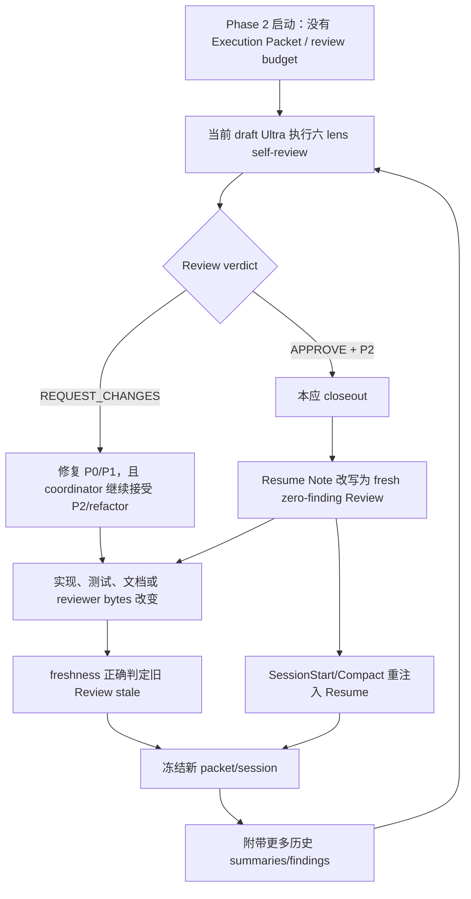

# v0.27 Harness 循环事故复盘与整改施工合同

> **状态**：`proposal — owner review required`
> **事故范围**：`v027-task-acceptance-v2` / Phase 2 自举施工
> **整改阶段**：`H0 — Harness Loop Closure`，必须先于当前 Phase 3
> **实现责任**：ZCode
> **审查责任**：Codex root，仅审查和给意见，不直接修改实现
> **外部 effect**：本文不授权 commit、push、tag、publish、install、deploy 或 provider spend
> **权威边界**：本文只有在 owner 明确接受后才成为后续施工合同；在此之前不得据此启动代码修改

## 0. 执行结论

Phase 2 暴露的不是普通效率问题，而是一个可复现的 Harness 架构事故：

1. Ultra Builder Pro 使用正在修改中的 v0.27 workflow 审查并修复自己；
2. Phase 2 已经依赖严格 Review、freshness、Resume recovery 和全量历史处置；
3. 负责 scope、budget、owner approval 和 invalidation 的 Execution Packet 却被排到
   Phase 3；
4. 负责完整 review lifecycle 的 closure 又被排到 Phase 4；
5. v0.26 已有的 repair round 物理上限被删除，但替代它的 resource budget 尚不存在；
6. mutable Resume Note 把“再运行一次 zero-finding Review”写成恢复指令；
7. SessionStart 和 compaction Hook 没有启动 Review，但不断重新注入这条恢复指令；
8. 每轮 Review 都读取更多历史 summaries/findings，并继续改变被审查的 Harness 本身；
9. coordinator 没有在连续暴露不同根因时停止并回到 owner，而是持续自动修复；
10. 在 Phase 2 完成且 Phase 3 仍为 `pending` 时，PostEdit Hook 仍把事故文档编辑自动
    归因到 `v027-autonomy-packet` 的 derived progress。

因此，本次事故的准确结论是：

> Ultra 让循环变得可达；coordinator 错误地持续执行了它；Hooks 让错误恢复指令跨会话
> 持久化；六镜头和历史重放让成本不断膨胀。

在 H0 完成并由 owner 接受前：

- 不启动 `v027-autonomy-packet`；
- 不再运行新的 Phase 2 strict Review；
- 不把 zero-finding 当作任何完成条件；
- 不继续修复 Phase 2 历史 P2/P3；
- 不用当前工作树中的 `ultra-review` 独立批准对自身的修改；
- 不扩大当前 Change 的 product scope。

## 1. 原始第一性原则

本次整改不是推翻 file-first，而是恢复它原本保护的边界。

| 原则 | 原始含义 | 本次漂移 | H0 恢复方式 |
|---|---|---|---|
| FP-1 | files + Git 承载跨 session/Host 的 durable authority | 错误 Resume 被 durable 化后持续驱动工作 | 文件仍保留，但每个字段必须有窄语义；Resume 只导航 |
| FP-2 | 机械系统不决定意义、质量和完成 | zero-finding、exact token、mutation count 逐渐成为完成代理 | Review verdict 只按 blocking contract 路由；P2/P3 返回模型/owner |
| FP-3 | autonomy 是有 scope、budget、gate、recovery 的执行 | manual grant 没有 task/review/repair budget | H0 使用 owner 批准的 exact 4 小时 bootstrap budget |
| FP-4 | adversarial review 暴露盲点和 disagreement | Review 变成必须把自身 findings 消灭到零的优化循环 | finding 是 evidence；审查不自动产生下一轮任务 |
| HC-3 | 不增加 MCP、database、daemon、semantic state machine | route authority 分散到 context、Hook、Review、tests，形成隐形文件状态机 | 删除重复 route authority，不新增 runtime semantic state |
| HC-4 | canonical meaning 与 derived observation 分离 | Resume、历史 Review、validator 观察开始覆盖 current verdict | 明确 routing precedence；历史只保留 provenance |

### 1.1 需要继续保留的设计

- owner-readable canonical files；
- stable `change_id`；
- task ledger 的 `pending | in_progress | completed`；
- typed acceptance evidence；
- immutable Review packet/receipt；
- exact permission、scope、resource、identity、freshness 和 effect checks；
- reachable repair/retry/cancel/abandon；
- Review findings 和 disagreement 的完整保留；
- fresh session 不继承 live activation；
- hostile concurrent writer 依赖 Host isolation，不用无限 replay 猜测稳定点。

### 1.2 必须删除或降级的设计

- zero-finding completion；
- 自动修复 P2/P3；
- “Review 发现任何可修项就继续”的默认行为；
- Resume Note 对 workflow route、scope、budget 或 verdict 的覆盖能力；
- 每轮重新加载全部历史 findings；
- 每次 delta 都默认再跑六个 lens；
- reviewer 修改自己后再用新 reviewer 证明自己正确；
- 通过更多 regex、counter、digest 或 mutation fixture 证明语义质量；
- 没有 owner checkpoint 的 Test ↔ Deliver 或 Dev ↔ Review 往返。

## 2. 已确认的事故事实

### 2.1 时间和规模

Phase 2 strict Review 的可见窗口：

- 第一份 packet：2026-08-15 13:47:43 +0800；
- 第一份 SUMMARY：2026-08-15 14:10:46 +0800；
- 最终 SUMMARY：2026-08-16 07:49:46 +0800；
- Review 可见耗时：17 小时 39 分；
- owner 记录的端到端耗时：约 25 小时；
- Review sessions：19；
- specialist artifacts：114；
- 最终一轮 reviewed paths：55；
- 最终一轮历史 SUMMARY：18；
- 最终一轮历史 findings：162。

第一次 `APPROVE` 出现在 2026-08-16 04:16:45，内容为：

- P0：0；
- P1：0；
- P2：2；
- verdict：`APPROVE`。

按照当前 `unified-schema.md`，该 verdict 已经满足任务级 closeout 条件。之后仍继续四轮，
直到 zero-finding，证明终止条件没有服从正式 verdict。

### 2.2 实际使用了 Ultra workflow

Phase 2 实质使用了以下 Ultra surface：

- active Change intent；
- `.ultra/tasks.json` task ledger；
- canonical task context；
- typed task acceptance/evidence；
- immutable Worker Packet / ADMISSION / specialist artifacts / SUMMARY；
- 六 lens Review；
- SessionStart / recall / compact / post-edit Hooks；
- Review-to-Test 和 Deliver retention/freshness contracts。

这不是“没有使用 Ultra，随后被 Hook 意外接管”。Hooks 的注册面没有 Review launcher：

- `session_context.py`：注入 North Star、Acceptance、Resume；
- `mid_workflow_recall.py`：编辑前重述 Acceptance；
- `compact_context.py`：保存/恢复 derived snapshot；
- `post_edit_guard.py`：记录 observation；
- `block_dangerous_commands.py`：约束危险 shell effect。

Hooks 没有创建 Review session。新 Review session 是 coordinator 主动创建的。

但是本次文档写入现场复现了另一个 Hook 缺陷：

- ledger 中没有 `in_progress` task；
- `v027-autonomy-packet` 仍是 `pending`，且没有 current-session live activation；
- `current_task_selection()` 自动选择第一个 dependency-ready `pending` task；
- `post_edit_guard.py` 随后更新
  `.ultra/progress/v027-autonomy-packet.json`；
- touched files 包含本事故文档和 WIP；
- ledger 没有被改写，Review 也没有被启动，但 Phase 3 progress 被错误污染。

因此对 Hooks 的完整结论是：

- 它们不是 Review 循环的 launcher；
- 它们会持续注入错误 Resume；
- 它们还会在没有 live task authority 时，把普通编辑归因给下一个 pending task。

### 2.3 当前 phase 状态

- `v027-north-star-v2`：completed；
- `v027-task-acceptance-v2`：completed；
- `v027-autonomy-packet`：pending；
- Phase 3–8：未开始；
- 当前工作树仍是大规模 dirty state；
- 本文写入前没有启动 ZCode；
- Phase 2 历史 evidence 和 Review receipts 必须保留，不得删除或重构。

## 3. 事故因果链



这个循环不是数学上的真正无限循环，而是一个没有总预算、没有 terminal precedence、
每轮成本还增长的 recurrence。只要下一轮还能产生一个新 observation 或 P2，`stalled`
就不会被 coordinator 主动判定。

## 4. 根因分析

### 4.0 责任归因：不是单一组件，也不是 file-first 本身

| 层 | 事故角色 | 精确结论 |
|---|---|---|
| Ultra workflow design | 结构根因 | Phase 2 在 Phase 3 budget/scope authority 和 Phase 4 review lifecycle 之前自举；同时存在冲突 terminal、无总预算、self-review 和无界历史输入 |
| Codex coordinator | 必要执行放大器 | 主动创建后续 Review、自动修 P2、扩大 PPI，且在第三个不同 architecture root 后没有停止；这是本次 25 小时事故中我必须承担的执行错误 |
| Hooks | persistence/activation 放大器 | 没有启动 Review，但反复注入错误 Resume；还把 pending frontier 推断为 active task 并写 derived progress |
| Six-lens Review | 成本乘数 | 每轮六份 artifact 和历史重处置放大 token/time；它不是最初 route authority，但缺少 initial/delta/aggregate 区分使成本失控 |
| file-first | 不是根因 | 文件忠实保存了错误 route；问题是字段语义、precedence 和 exit 不完整，不是“不应该用文件” |
| repository `AGENTS.md` / `CLAUDE.md` | 不是冲突根因 | 两者都保留 host model route ownership、禁止 semantic state machine，并要求最小 authority；没有指示自动 Review 到零 |
| personal `AGENTS.md` / `~/.claude/CLAUDE.md` | 已有但未执行的保险丝 | 都要求 repeated mechanisms 时 deletion-first redesign，并明确第三个不同根因后停止；`loop to done` 只有在 done 已被正确定义时成立，本次却被错误 Resume 重定义为 zero-finding |

缺少任一放大条件，事故规模都会显著下降：

- Ultra 如果有 terminal precedence 和总预算，coordinator 的错误会被机械截断；
- coordinator 如果执行三根因 stop，Ultra 的缺陷会在约第三轮暴露后停止；
- Hooks 如果不持久化错误 Resume、不推断 pending activation，错误不会稳定跨 session；
- Review 如果只做 affected-lens delta、只读取 direct parent，单轮成本不会随历史近似累加增长。

所以整改不能只加一个 counter，也不能只要求“下次更谨慎”。必须同时修复产品 contract，
并把 coordinator 的人工 stop discipline 变成明确、可见、但不决定语义的执行边界。

### RC-01 — Phase graph 存在反向依赖

**证据**

- 正式计划先做 Phase 2 Task/Acceptance；
- Phase 3 才实现 Execution Packet、scope/budget、approval 和 invalidation；
- Phase 4 才闭合全 lifecycle Review；
- Phase 2 却已经用新 strict Review 和 future packet semantics 完成自己。

**影响**

- Phase 2 没有 scope fingerprint；
- PPI 的每次扩展都可以写成“没有 packet，所以没有 invalidation”；
- Review 的 transport、verdict、history 和 freshness 同时处于被审查、被修改、被消费状态；
- self-host bootstrap 没有稳定 verifier。

**整改**

- 新增 H0，先关闭循环和 self-hosting 边界；
- H0 后才能开始 Phase 3；
- Phase 4 必须依赖 Phase 3；
- ledger 中必须写出真实 dependencies，不能只依赖数组顺序或 prose phase。

### RC-02 — 混淆 semantic convergence 和 physical budget

**证据**

- v0.26 曾有最多三轮 repair 的物理 ceiling；
- v0.27 正确删除“round 数决定语义质量”；
- active intent 又明确没有 persisted task/review/repair budget；
- Review 文本却要求“在 authorized physical resource budget 内继续”。

**影响**

`authorized budget remains` 的事实来源为空。budget exhaustion 被写成 recovery，但没有
任何数字、deadline、counter 或 owner-approved grant 可以触发它。

**整改**

- round/time/tool/cost 只控制资源，不产生 semantic verdict；
- 每次 autonomous execution 必须有 exact budget；
- 本次 H0 的 owner proposal：
  - `max_zcode_active_time: 4h`，累计覆盖 initial implementation、最多一次 repair 和 prescribed closeout；
  - `max_initial_reviews: 1`；
  - `max_delta_reviews: 1`；
  - `max_auto_repair_sets: 1`；
  - `max_concurrent_writers: 1`；
- budget 用尽返回 `owner_checkpoint / budget_exhausted`，任务保持 `in_progress`；
- 不得把 budget stop 改写为 pass、fail、accept 或 abandon。

### RC-03 — 两个互相冲突的完成条件

**正式 Review contract**

- 没有 P0/P1；
- 两个 axis 为 PASS；
- artifacts 完整/current；
- 即 `APPROVE`。

**事故中的 Resume contract**

- 修复 APPROVE 后的 P2；
- 再运行 fresh zero-finding strict Review。

**影响**

低优先级的 mutable field 覆盖了高优先级的 current Review verdict。

**整改**

- `APPROVE` 立即结束当前 task Review；
- P2/P3 不阻止 closeout；
- 如果 owner 希望处理某个 P2，创建新的 task 或明确 owner-selected repair；
- 不允许在原 task 内把 P2 隐式提升为 blocker；
- 如果 evidence 证明 P2 实际阻止 acceptance，应在当前 Review 中按证据重分类为 P1，
  而不是保持 P2 标签却按 P1 路由。

### RC-04 — Resume Note 的语义过宽

**证据**

- template 称 Resume Note 为跨 session/Host “single most important line”；
- compact/session hooks 反复称 Acceptance 和 Resume Note authoritative；
- context 是 canonical artifact，但 Resume 子字段没有声明窄语义；
- fresh sessions 因此持续重放“再 Review”。

**影响**

file-first 把一个错误的 next-step suggestion durable 化成 route authority。

**整改**

Resume Note 只能记录：

- 当前 checkpoint；
- 下一项已经被更高权威允许的动作；
- unresolved prerequisite；
- cheapest safe resume command/path。

Resume Note 不得：

- 改写 Acceptance；
- 改写 Review verdict；
- 把 P2/P3 提升为 blocker；
- 扩大 PPI、scope、budget 或 allowed workflow；
- 推断 live activation；
- 要求 zero-finding；
- 在 current `APPROVE` 后启动同一 subject 的新 Review。

Hooks 可以注入 Resume 内容，但必须明确：

> Resume Note is navigational context. It cannot override current owner authority,
> approved scope/budget, task acceptance, or a validated Review verdict.

### RC-05 — Reviewer 与 reviewed subject 自引用

**证据**

Phase 2 reviewed scope 包含 `skills/ultra-review/SKILL.md`，而 Review worker 同时读取当前
working-tree 的 Review contract。

**影响**

- 修改 reviewer 会让旧 Review stale；
- 新 reviewer 再审新 reviewer；
- 没有 stable control，无法区分产品修复与评判标准漂移。

**整改**

触及下列任一路径即进入 `self_hosting_review`：

- `skills/ultra-review/**`；
- `skills/ultra-dev/**` 中 review routing；
- `skills/ultra-test/**` 中 Review consumption；
- `skills/ultra-deliver/**` 中 Review/Test bounce；
- `skills/ultra-review/scripts/review_wait.py`；
- Review packet/schema/transport tests；
- Hook route/Resume authority。

H0 期间：

- ZCode 负责实现；
- Codex root 按本文和 owner acceptance 做一次人工 diff review；
- 不使用正在被修改的 local `ultra-review` 为自己生成完成证明；
- released `v0.26.2` 可作为历史行为对照，但不能替代本文的新 accepted contract；
- owner 接受的本文 SHA-256 是 H0 的稳定语义基线；
- H0 完成后，才允许用修复后的 Review 做一次非递归验证。

### RC-06 — 历史 Review 输入无界增长

**证据**

最后一轮 packet 包含 18 个历史 SUMMARY、162 个历史 findings；六个 lens 又分别重新
disposition 全部历史。

**影响**

- 每轮输入随历史增长；
- 已解决 finding 被反复重新解释；
- 当前 delta 越小，review provenance 越大；
- reviewer 更容易从旧问题继续发散到相邻 contract。

**整改**

新 task Review packet 只允许：

- 当前 subject；
- 最多一个 direct parent SUMMARY ref + digest；
- parent 中仍 unresolved 的 current P0/P1 IDs；
- 本轮 delta 涉及的 evidence refs。

不允许：

- 把完整 transitive SUMMARY chain 交给每个 lens；
- 要求每个 lens disposition 已解决历史 finding；
- 把 historical count 当 coverage 或质量证明。

完整历史仍保留在 `.ultra/reviews/**`，但只在专门 incident/audit 请求中读取。

### RC-07 — Initial review 与 delta review 没有分开

**证据**

- Review 默认选择六个 lens；
- 修复后文本又说只 rerun affected lenses；
- packet/schema 没有把 initial 和 delta 的选择边界说清楚；
- coordinator 因此每轮都运行完整六 lens。

**整改**

- `initial task review`：
  - `review-spec` 必选；
  - 其余 lens 按当前风险和 touched seams 选择；
  - major/high-risk task 可以 owner-approved 全六 lens；
- `delta review`：
  - 只运行能受 exact repair 影响的 lens；
  - 不重新审计整个 task；
  - 最多一次；
- `aggregate Test/Change review`：
  - 可以全六 lens；
  - 不回写当前 task 的非阻断 refactor；
- skip rationale 是 evidence，不是“少做工作”的借口；
- 全六 lens 的存在不等于每个 task、每个 delta 必须全跑。

### RC-08 — Coordinator 没有执行已有 stop discipline

个人和项目规则都已经要求：

- repeated fixes 增加机制时停止 patch，改做 deletion-first redesign；
- 三次修复暴露不同底层根因后停止并报告 architecture problem。

事故中 coordinator：

- 自动接受 P2/refactor；
- 把 zero-finding 写入 Resume；
- 多次扩大 path inventory；
- 没有在第三个不同根因时停下；
- 把 owner 的“百分之百完成”误读为无预算、无 checkpoint 的继续授权。

这是执行错误，不由 Ultra 产品缺陷免责。

### RC-09 — Pending frontier 被错误当作 active task

**证据**

- `hooks/_common.py::current_task_selection()` 在没有 `in_progress` 时选择第一个
  dependency-ready `pending` task；
- SessionStart、mid-workflow recall 和 PostEdit 共用该 selection；
- 本文创建时，PostEdit 将两份事故文档写入
  `.ultra/progress/v027-autonomy-packet.json` 的 `touched_files`；
- owner 尚未激活 Phase 3，ledger 也仍为 `pending`。

**影响**

- pending frontier 与 active execution 被混为一谈；
- fresh session 可以从 files 推断“当前任务”；
- 无关编辑污染未来 task 的 derived evidence；
- Resume/Acceptance 注入可能让模型误以为 owner 已授权继续；
- 这虽然不是 canonical status mutation，但会影响 model context 和后续 evidence
  interpretation。

**整改**

- `pending` task 可以被 Status 报告为 `frontier candidate`，不能被 Hooks 当作 active；
- SessionStart 只有在：
  - ledger 唯一 `in_progress`，或
  - 当前 trusted invocation 明确给出 exact task id
  时才能注入 task Acceptance/Resume；
- PostEdit 只有在同一条件下才能写 task progress；
- 没有 active task 时，PostEdit 对普通编辑保持 task-progress silent；
- 不新增 persistent activation bit；
- `frontier candidate` 观察不得升级为 workflow selection。

## 5. 正确的 agency boundary

| 角色/Surface | 可以决定 | 不可以决定 |
|---|---|---|
| Owner | outcome、acceptance、material scope、risk、budget、外部 effect、P2 是否另开任务 | 不需要逐项决定技术实现 |
| Host model | decomposition、strategy、semantic completeness、evidence interpretation、finding disposition recommendation | 不得扩大 owner grant 或自批外部 effect |
| Harness | exact identity、scope、permissions、budgets、schemas、receipts、freshness、recovery | 不得决定产品意义、质量、优先级或 zero-finding |
| Review | 产生 evidence-backed findings、axis verdict、current blocking set | 不得自动修改代码、自动创建下一轮、替 owner 接受 risk |
| Resume Note | 记录导航 checkpoint 和已授权 next step | 不得改写 scope/budget/acceptance/verdict |
| Hooks | 观察、提醒、阻止 exact destructive effect；可报告 pending frontier candidate | 不得把 pending 当 active、选择 workflow、启动 Review、完成 task 或推断 activation |
| Tests/validators | 证明机械 contract 如写运行 | 不得证明 North Star 正确、设计充分或模型输出质量 |

### 5.1 Live task 的唯一判定

`trusted exact task invocation` 指当前、invocation-local、由 owner-invoked public workflow
或已授权 delegation argv 明确携带的 task id。它必须与 ledger/task context/bootstrap grant
机械匹配；Resume、progress、目录排序、first pending、compact snapshot 和历史 Review 都不
是 trusted invocation。该 task id 不得持久化为 selector。

| Observation | Hook behavior | Workflow effect |
|---|---|---|
| 唯一 `in_progress` | 可注入该 task 的 Acceptance/Resume，PostEdit 可写 derived progress | 不选择下一 workflow |
| exact trusted invocation 指向一个 authorized pending task | 只服务这次 invocation；Dev/Plan 负责按 contract 激活并 readback | 不把调用参数持久化为 activation state |
| 0 个 `in_progress`，只有 pending frontier | task-silent、progress-silent；Status 可报告 candidate | 不激活、不注入 Acceptance/Resume |
| 多个 `in_progress` | typed ambiguity diagnostic + reachable owner/Plan repair；task/progress silent | 不自动 demote 或选第一个 |
| ledger/context 不可稳定读取 | typed physical diagnostic + restore/retry guidance；task/progress silent | 不推断 fallback task |
| completed task | 只作为历史 status/evidence | 永不恢复为 active |

## 6. Routing precedence

以下是 workflow route 的冲突解析顺序，不替代现有 artifact semantic hierarchy：

1. 当前 owner 明确指令、已接受 decision 和 external-effect authorization；
2. 当前 accepted North Star / active Change intent；
3. 当前 owner-approved bootstrap grant 或 Execution Packet 的 scope、budget、allowed workflow；
4. task ledger、task acceptance、PPI 和依赖；
5. 当前 validated Review SUMMARY 的 `APPROVE | REQUEST_CHANGES | INCOMPLETE`；
6. current evidence/Test observation；
7. Resume Note；
8. Hooks、progress、compact snapshot、历史 Review 和其他 derived observations。

低层 artifact 与高层冲突时：

- 低层不得覆盖高层；
- 输出 typed conflict diagnostic；
- 保留原 bytes；
- 路由到最近的 repair/owner checkpoint；
- 不自动“选择更安全”的语义结果。

## 7. 纠正后的 task workflow

这些是概念 transition，不新增 persisted workflow state enum。ledger 仍只有
`pending | in_progress | completed`。

```text
owner-approved task + budget
  -> implementation/TDD
  -> initial task Review
     -> APPROVE
        -> publish evidence
        -> context closeout
        -> ledger completed
     -> REQUEST_CHANGES
        -> exact current P0/P1 only
        -> one in-scope repair set
        -> one affected-lens delta Review
           -> APPROVE
              -> closeout
           -> REQUEST_CHANGES
              -> owner checkpoint / new task / scope reconciliation
           -> INCOMPLETE
              -> repair missing review evidence if still inside budget
              -> otherwise owner checkpoint
     -> INCOMPLETE
        -> repair missing worker/receipt/evidence only
        -> never auto-repair product meaning
```

### 7.1 Finding routing

| Severity | 默认 route | 自动修改当前 task？ | 结束当前 Review？ |
|---|---|---:|---:|
| P0 | REQUEST_CHANGES；立即停止相关 effect | 仅在 scope/budget 内且无 owner-only decision 时 | 否 |
| P1 | REQUEST_CHANGES | 最多一个 repair set | 否 |
| P2 | APPROVE 可保留；进入报告或 owner-selected backlog | 否 | 是 |
| P3 | optional suggestion | 否 | 是 |

### 7.2 Scope drift

Review finding 落在 PPI 外时：

1. 记录 exact finding；
2. 分类为 `scope_change_proposal`；
3. 不修改该路径；
4. 返回 owner/Plan；
5. owner 接受后更新 task/PPI/packet；
6. 作为新 subject 执行，不把原 Review 无限延长。

### 7.3 Freshness

必须继续保证：

- reviewed implementation/evidence 变化使旧 Review stale；
- prescribed closeout metadata 不自我 invalidate；
- post-seal write 由下一 consumer fresh recapture 发现；
- hostile writer 需要 Host sandbox/isolated worktree。

但 freshness 不得和 automatic P2 repair 组合成循环：

- `APPROVE + P2` 不触发 repair，因此不会产生新 subject；
- 只有 owner-selected scope change 或 P0/P1 repair 才产生 delta subject；
- delta review 用尽后即 owner checkpoint。

### 7.4 Deliver

Deliver 只能：

- reconcile 已接受的 current Test evidence；
- 修复 delivery artifact 自身的机械错误；
- 报告 duplication/coupling/debt。

Deliver 不得在通过 Test 后自动重构 product source。若发现实现问题：

- P0/P1：返回 Dev，但最多形成一个新 owner-approved task；
- P2/P3：记录 backlog/residual risk，不回写当前 delivery；
- 不允许无界 Test ↔ Deliver bounce。

### 7.5 H0 writer/reviewer/closeout 顺序

1. ZCode 是唯一实现 writer；完成 RED/GREEN 后停止写入，H0 ledger 保持
   `in_progress`，Resume 只写 `awaiting external manual review`；
2. Codex root 只读检查 diff/evidence，不写 repo；
3. 若有 P0/P1，只把 exact blocking set 交给 ZCode 一次；ZCode 使用剩余 active-time
   budget 修复，随后 root 只做一次 affected-delta review；
4. 若无 P0/P1，Codex 报告 owner，不因 P2/P3 自动返工；
5. owner 接受结果后，ZCode 才执行 prescribed closeout-only writes：final
   `evidence.json`、context Task Review/Completion/Resume、ledger `completed` 和 readback；
6. closeout 不得修改 product implementation、Review contract 或 tests；如果需要，停止并
   作为新 task/scope proposal；
7. root 最后只读核对 closeout facts 并向 owner 报告，不再启动 Review。

`max_zcode_active_time` 在 ZCode 每次 handoff 时累计记录；等待 owner/root 的时间不计入，
但等待本身不授权任何后台或自动工作。累计达到 4 小时即停止，不能另开 session 清零。

## 8. 修正后的 phase DAG

新增 H0，不重写已经完成的 Phase 1/2 历史事实。

```mermaid
flowchart LR
    P1["Phase 1 North Star — completed"] --> P2["Phase 2 Task/Acceptance — completed historical"]
    P2 --> H0["H0 Harness Loop Closure"]
    H0 --> P3["Phase 3 Autonomy + Execution Packet"]
    P3 --> P4["Phase 4 Adversarial Lifecycle"]
    P4 --> P5["Phase 5 Delegation Snapshot"]
    P5 --> P6A["Phase 6A Host Adapters + Hooks"]
    P6A --> P6B["Phase 6B Doctor + Provenance"]
    P6B --> P7["Phase 7 Docs + Evals + Release Gate"]
    P7 --> P8["Phase 8 Migration + Real-host Acceptance"]
```



建议 task graph：

| Task | depends_on |
|---|---|
| `v027-harness-loop-closure` | `v027-task-acceptance-v2` |
| `v027-autonomy-packet` | `v027-harness-loop-closure` |
| `v027-adversarial-lifecycle` | `v027-autonomy-packet` |
| `v027-delegation-snapshot` | `v027-adversarial-lifecycle` |
| `v027-host-adapters-hooks` | `v027-delegation-snapshot` |
| `v027-doctor-provenance` | `v027-host-adapters-hooks` |
| `v027-migration-acceptance` | `v027-doctor-provenance` |

如果后续证明两个 task 真正独立，可以由 owner-approved Plan 修改依赖；不得为了并行而
省略真实 dependency。

## 9. H0 owner bootstrap grant

Execution Packet 尚未实现，H0 不能伪造一个历史 packet。owner 接受本文后，应创建一个
最小、一次性的 bootstrap record，绑定：

- 本文 path、SHA-256 和 owner acceptance；
- H0 task id；
- exact planned paths；
- `max_zcode_active_time: 4h`；
- `max_initial_reviews: 1`；
- `max_delta_reviews: 1`；
- `max_auto_repair_sets: 1`；
- `allowed_writer: ZCode`；
- `review_mode: external_manual`；
- `reviewer: Codex root, read-only`；
- no commit/push/tag/publish/install/deploy；
- scope drift、budget exhaustion、第二次 blocking delta 的 owner checkpoint；
- recovery snapshot path。

这个 bootstrap record：

- 不是 Execution Packet v1；
- 不被未来 session 自动继承；
- 不代表 owner 接受实现；
- H0 完成后即不再授权新工作；
- Phase 3 必须用正式 Execution Packet 替代它，不能长期保留第二套机制。

这里的 initial/delta Review 指 Codex root 按第 15 节执行的外部人工 diff review；H0
不得调用正在修改中的 local `ultra-review` 生成 self-approval receipt。

## 10. ZCode 实施包

### 10.0 Proposed exact path scope

下面是 owner 可接受的 H0 最大 allowlist，不是“每个文件都必须改”的配额。ZCode 只能在
真实 RED 或 canonical reconciliation 证明需要时修改其中路径；任何额外路径都必须停止并
返回 scope-change proposal。

**CREATE**

| Path | Purpose |
|---|---|
| `.ultra/decisions/2026-08-16-v027-harness-loop-closure.md` | 原样记录 owner acceptance、本文 digest、一次性 bootstrap grant |
| `.ultra/contexts/task-v027-harness-loop-closure.md` | H0 acceptance、PPI、budget、Resume checkpoint；不得复制整份事故说明 |
| `.ultra/evidence/v027-harness-loop-closure/verification.log` | ZCode 的 exact RED/GREEN/raw command receipt |
| `.ultra/evidence/v027-harness-loop-closure/evidence.json` | H0 完成后才写入的 canonical task evidence |

**MODIFY — canonical/live consumers**

| Path | Purpose |
|---|---|
| `.ultra/tasks.json` | 插入 H0，修正 Phase 3–8 dependencies；Phase 3 保持 pending |
| `.ultra/changes/active/chg-v027-lifecycle-closure/intent.md` | Reconciliation、H0 scope/budget/stop 边界 |
| `docs/wip/v027-lifecycle-closure.md` | 唯一 owner-facing checkpoint |
| `docs/V027-LIFECYCLE-CLOSURE.zh-CN.md` | 修正 phase DAG 和 open-ended review loop |
| `docs/ARTIFACT-AUTHORITY.md` | routing precedence、Resume/history/progress authority |
| `docs/WORKFLOW-LIFECYCLE.md` | task Review terminal route |
| `.ultra-template/contexts/TEMPLATE.md` | Resume 的窄语义和 precedence |
| `skills/ultra-review/SKILL.md` | initial/delta/aggregate、terminal、budget、self-host boundary |
| `skills/ultra-review/references/unified-schema.md` | canonical verdict/severity route |
| `skills/ultra-review/references/worker-packet.md` | direct-parent/unresolved-blocker packet |
| `skills/ultra-dev/SKILL.md` | 一次 P0/P1 repair 和 budget checkpoint |
| `skills/ultra-test/SKILL.md` | P2/P3 不自动回写 Dev |
| `skills/ultra-deliver/SKILL.md` | 禁止无界 Test/Deliver bounce |
| `skills/ultra-status/SKILL.md` | frontier candidate、active task 和 budget stop 的显示边界 |
| `skills/ultra-plan/references/task-evidence-v2.md` | current blocking disposition binding |
| `hooks/README.md` | Hook non-routing/non-activation contract |
| `hooks/_common.py` | 唯一 live-task selection；pending 不得自动升级 |
| `hooks/session_context.py` | no-live-task task-silent |
| `hooks/mid_workflow_recall.py` | no-live-task task-silent |
| `hooks/post_edit_guard.py` | no-live-task progress-silent |
| `hooks/compact_context.py` | Resume 不覆盖 verdict/scope/budget |
| `tests/v026-contract.test.cjs` | terminal/budget/Resume/task-graph contract regressions |
| `tests/review-transport.test.cjs` | direct parent、blocking set、initial/delta selection |
| `tests/project-artifacts.test.cjs` | H0 task graph/PPI/active-task audit |
| `tests/task-evidence-v2.test.cjs` | blocking disposition/evidence closeout |
| `hooks/tests/test_v026_hooks.py` | no-live-task、non-routing、Resume precedence matrix |

**CONDITIONAL — 只有先出现对应真实 RED 才能加入 changed set**

| Path | Condition |
|---|---|
| `README.md` | public text 仍复制旧 terminal/activation 规则 |
| `skills/ultra-review/scripts/review_wait.py` | 现有 validator 无法表达 direct-parent 或 budget 的 exact machine invariant |
| `tests/skill-authoring.test.cjs` | changed Skill 的 live static consumer 需要同步，而 Skill Creator validation 不足 |
| adapter files | 某 Host 的真实 Hook output 与共享 contract 不一致 |

**READ-ONLY / MUST NOT REWRITE**

- 本文及其 owner-accepted digest；
- `.ultra/north-star.md`；
- Phase 1/2 canonical evidence、raw logs、Review packet/ADMISSION/artifacts/SUMMARY；
- existing completed ledger rows；
- package/release/version/install surfaces。

### WP-0 — Recovery 与 baseline

ZCode 必须先：

1. 读取本文、项目 `AGENTS.md`、North Star 和 active Change；
2. 验证 owner 已接受本文 exact digest 和 H0 bootstrap grant；
3. 创建当前 dirty worktree 的可恢复副本，保存于 repository 外；
4. 记录 `git rev-parse HEAD`、`git status --short` 和授权 path list；
5. 确认 Phase 2 evidence/reviews 不会被修改；
6. 运行当前 narrow baseline；
7. 不运行新的 Phase 2 Review。

### WP-1 — 先写事故回归 RED

先增加能复现本次事故的行为测试，不先改实现或 prose。

必须覆盖：

1. `APPROVE + P2` 直接 close，不生成 fresh Review route；
2. Resume 中的 `zero-finding` 不能覆盖 current APPROVE；
3. REQUEST_CHANGES 只返回 exact P0/P1；
4. 一次 blocking repair 后只允许一次 affected-lens delta；
5. 第二次 REQUEST_CHANGES 返回 owner checkpoint；
6. budget exhaustion 保持 task `in_progress` 且不生成 semantic verdict；
7. self-hosting subject 没有 pinned reviewer 时停止；
8. 新 Review packet 只允许一个 direct parent，不重放 transitive history；
9. Hook output 不包含 workflow invocation/Review launch；
10. PPI 外 finding 不产生 repo edit；
11. closeout metadata 不 reopen implementation Review；
12. task graph 把 H0 放在 Phase 3 前；
13. 没有 live task 时，事故文档编辑不会更新任何 pending task progress；
14. trusted exact task invocation 只在当前 invocation 生效，不写 persistent selector；
15. 多 `in_progress`、ledger/context unreadable 时四个 task-aware Hook 均 task/progress silent，
    并给出 typed reachable repair。

### WP-2 — 最小 contract 修复

修改最小 authority surface，优先删除重复规则。

| Path | 必须修改 |
|---|---|
| `docs/V027-LIFECYCLE-CLOSURE.zh-CN.md` | 替换 open-ended task review loop；插入 H0；更新 phase DAG、done/stop 语义 |
| `docs/ARTIFACT-AUTHORITY.md` | 增加 routing precedence；限定 Resume 为 navigation |
| `docs/WORKFLOW-LIFECYCLE.md` | 同步 task Review terminal routes，不复制整份事故说明 |
| `.ultra-template/contexts/TEMPLATE.md` | 删除 “single most important line” 的无限权威含义；写明不可覆盖 verdict/scope/budget |
| `skills/ultra-review/SKILL.md` | 区分 initial/delta/aggregate；P0/P1-only repair；budget；self-host pin；禁止 zero-finding loop |
| `skills/ultra-review/references/unified-schema.md` | 明确 APPROVE+P2 terminal；finding severity route |
| `skills/ultra-review/references/worker-packet.md` | 一个 direct parent + unresolved blocking set；禁止全历史重放 |
| `skills/ultra-dev/SKILL.md` | physical budget 与 owner checkpoint；恢复 P0/P1-only closeout |
| `skills/ultra-test/SKILL.md` | Test 不自动修 P2；aggregate finding disposition |
| `skills/ultra-deliver/SKILL.md` | 禁止 post-approve opportunistic refactor 和无界 Test bounce |
| `skills/ultra-status/SKILL.md` | 显示 budget stop/owner checkpoint，不推断 continuation |
| `skills/ultra-plan/references/task-evidence-v2.md` | 只绑定 current blocking dispositions；P2/P3 保留但不阻断 |
| `hooks/README.md` | Hook 不拥有 route；Resume 是 navigational context |
| `hooks/_common.py` | pending 只能是 frontier candidate；active selection 只接受唯一 `in_progress` 或 trusted invocation 的 exact task id |
| `hooks/session_context.py` | 无 active task 时保持 task-silent；注入时明确 authority limitation，不发 workflow action |
| `hooks/mid_workflow_recall.py` | 无 active task 时保持 task-silent；不得把 frontier candidate 写成 current task |
| `hooks/post_edit_guard.py` | 无 active task 时保持 progress-silent；不得把普通编辑归因给 pending task |
| `hooks/compact_context.py` | 删除 Resume 可覆盖 verdict 的 “authoritative” 表述 |

条件修改，只有真实 RED 证明需要时才允许：

| Path | 条件 |
|---|---|
| `skills/ultra-review/scripts/review_wait.py` | 只有 packet/parent/budget 的 exact machine invariant 无法由现有 validator 表达时 |
| `skills/ultra-plan/scripts/execution_packet.cjs` | 属 Phase 3，不在 H0 中提前实现 |
| adapter files | 只有某 Host 实际 Hook output 与共享 contract 不一致时 |

### WP-3 — Task graph 与 canonical project reconciliation

owner 接受 H0 方案后，ZCode 才可：

1. 新增 `v027-harness-loop-closure` task/context；
2. 修改 remaining v0.27 dependencies；
3. 在 active intent Reconciliation 中记录事故；
4. 写入 bootstrap grant 的 exact scope/budget；
5. 将 `v027-autonomy-packet` 保持 pending；
6. 不修改 Phase 2 completion/evidence/Review history；
7. 更新唯一 WIP 指向 H0 状态。

### WP-4 — GREEN 与验证

先 narrow，再 broader。测试绿灯只证明 mechanical contract。

建议命令：

```bash
node --test --test-name-pattern='task review APPROVE|Resume Note cannot override|one blocking delta|self-hosting review|review packet parent|Harness Loop Closure' tests/v026-contract.test.cjs tests/review-transport.test.cjs

PYTHONDONTWRITEBYTECODE=1 pytest -q -p no:cacheprovider \
  -k 'resume_navigation or compact_resume or review_route' \
  hooks/tests/test_v026_hooks.py

node --test --test-reporter=dot \
  tests/task-evidence-v2.test.cjs \
  tests/project-artifacts.test.cjs \
  tests/v026-contract.test.cjs \
  tests/skill-authoring.test.cjs \
  tests/review-transport.test.cjs \
  tests/package-smoke.test.cjs

PYTHONDONTWRITEBYTECODE=1 pytest -q -p no:cacheprovider \
  hooks/tests/test_v026_hooks.py

git diff --check
```

当前 239 Node / 83 Hook 只作为 pre-H0 baseline observation，不是未来固定 pass-count
semantic gate。新增测试后总数自然变化。

### WP-5 — Handoff

ZCode 交付必须包含：

- exact changed paths；
- 每个 changed path 对应的 `HL-*` criterion；
- RED 命令和首个真实失败；
- GREEN 命令、exit code 和结果；
- 未运行项；
- scope drift；
- budget 使用；
- remaining P0/P1/P2/P3；
- rollback path；
- 明确声明无 commit/push/tag/publish/install/deploy。

## 11. H0 Acceptance Criteria

| ID | Criterion | Verification type | Required evidence |
|---|---|---|---|
| HL-01 | `APPROVE` 在无 P0/P1 时 terminal，即使保留 P2/P3 | command + inspection | route regression、schema/Skill source |
| HL-02 | zero-finding 不再是任何 task/Review/Resume 完成条件 | command + inspection | live consumer search、negative regression |
| HL-03 | REQUEST_CHANGES 只路由 current P0/P1 或 owner-promoted blocker | command + inspection | severity fixture、consumer source |
| HL-04 | 一个 task 最多一次 initial + 一次 delta Review；耗尽返回 owner checkpoint | command | incident replay fixture |
| HL-05 | resource budget 只停止执行，不生成 pass/fail/accept verdict | command + inspection | budget fixture、diagnostic |
| HL-06 | Resume Note 不能覆盖 scope、budget、acceptance 或 Review verdict | command + inspection | Hook/session/compact fixtures |
| HL-07 | 五个 Hook 都不能启动或选择 Review/public workflow | command + inspection | registered Hook map、subprocess outputs |
| HL-08 | self-hosting review 必须使用 owner-accepted spec 和 stable external reviewer boundary | command + owner-judgment | subject-path fixture、owner record |
| HL-09 | delta packet 最多一个 direct parent，只携带 unresolved current blockers | command | packet/schema fixture |
| HL-10 | delta review 只选择 affected lenses；aggregate review 才可默认全六 lens | command + inspection | worker selection fixtures |
| HL-11 | PPI 外 finding 停在 scope-change proposal，不产生 edit | command | temp repo mutation fixture |
| HL-12 | prescribed closeout facts 不 self-invalidate；implementation change 仍 stale | command | positive/negative freshness fixture |
| HL-13 | remaining task graph 是显式、无环、无 backward dependency | command | task graph validator |
| HL-14 | H0 不新增 MCP、DB、daemon、semantic registry、persistent workflow state | inspection | final diff |
| HL-15 | current primary path 可在一个 Review 或一个 repair+delta 后结束 | command + model judgment | end-to-end incident replay |
| HL-16 | owner 接受本文 exact digest、H0 path scope 和 4h budget | owner-judgment | durable owner record |
| HL-17 | pending frontier 不等于 active task；无 live task 时 Hooks task-silent、progress-silent | command + inspection | no-live-task Hook matrix、ledger/progress readback |

## 12. 必须杀死的 mutants

H0 tests 至少要让以下 mutation 真实 RED：

1. 把 P2 改成 blocking；
2. 在 `APPROVE` 后追加 fresh Review；
3. 在 Resume 中加入 zero-finding 并让 consumer 采纳；
4. 删除 `max_delta_reviews`；
5. 把 budget stop 改成 `INCOMPLETE` 或 `REQUEST_CHANGES` semantic verdict；
6. 让 Hook 输出 `invoke ultra-review`；
7. 让 packet 携带两个 direct parents；
8. 让 delta review重新选择全部六 lens；
9. reviewer path 在 subject 内却没有 stable pin；
10. PPI 外 finding 自动加入 planned paths；
11. closeout metadata 触发 implementation review；
12. 从 task graph 删除 H0 → Phase 3 dependency；
13. 无 `in_progress` 时让 PostEdit 把事故文档归因给第一个 pending task；
14. 把 invocation-local exact task id 写成 persistent selector；
15. 多个 `in_progress` 时选择第一个而不是 typed stop。

Mutation 只证明 regression sensitivity，不证明产品意义正确。不要把 mutation count 写成
新的完成阈值。

## 13. 4 小时累计 ZCode active-time 预算

| 时间 | 工作 | Terminal output |
|---|---|---|
| 00:00–00:20 | WP-0：readback、backup、baseline、scope seal | baseline + recovery path |
| 00:20–01:00 | WP-1：事故 RED tests | exact RED evidence |
| 01:00–02:15 | WP-2：最小 contract/source 修复 | scoped diff |
| 02:15–03:00 | narrow GREEN + mutants | targeted evidence |
| 03:00–03:10 | broader Node/Hook + Skill validation、diff self-audit | initial handoff；暂停 ZCode timer |
| 03:10–03:50 | 保留给 root 发现的唯一 P0/P1 repair set；无 blocker 时不消费 | affected delta handoff 或 unused budget |
| 03:50–04:00 | owner 接受后的 prescribed closeout-only；未接受时不消费 | evidence/context/ledger readback 或 stop |

上表是 active-time 分配，不要求 owner/root 在真实十分钟内完成判断。ZCode handoff 后必须
停止执行；下一段只在收到相应 exact owner/root route 后继续，且累计计时不得重置。

以下任一发生立即停止，不消耗剩余预算：

- 第三个不同 architecture root；
- 需要新增未批准 product mechanism；
- 需要修改授权 path 外文件；
- baseline 与记录不符且无法解释；
- owner-only decision 缺失；
- working tree 出现第二 writer；
- 4 小时累计 active time 耗尽。

停止时保持 task `in_progress`，报告证据和 cheapest next action。不得自行延长预算。

## 14. ZCode 可直接执行的指令

```text
You are the sole implementation writer for H0 — Harness Loop Closure.

Read, in order:
1. repository AGENTS.md;
2. docs/V027-HARNESS-LOOP-INCIDENT-REMEDIATION.zh-CN.md;
3. the owner acceptance record binding that document digest;
4. .ultra/north-star.md;
5. the active Change intent;
6. the H0 task context and exact planned paths.

Your authority is limited to the accepted H0 bootstrap grant:
- max cumulative ZCode active time: 4 hours across implementation, at most one repair,
  and prescribed closeout; waiting does not authorize background work and does not reset it;
- one initial review and at most one affected-lens delta review;
- one automatic blocking-repair set;
- one writer;
- no commit, push, tag, publish, install, deploy, or provider spend.

Do not run Phase 3.
Do not reopen Phase 2.
Do not repair historical P2/P3.
Do not use the local changing ultra-review implementation to approve itself.
Do not add MCP, a database, daemon, semantic registry, persistent workflow state,
quality score, finding quota, or zero-finding gate.
Do not treat a pending frontier task as active without a trusted exact task invocation.

Work red-first:
1. preserve a recovery snapshot;
2. reproduce the incident transitions;
3. implement the smallest contract changes;
4. run narrow then broader verification;
5. stop at the first owner checkpoint, scope drift, third root, or budget exhaustion.

Return:
- exact diff paths;
- HL criterion trace;
- RED/GREEN evidence;
- residual findings by severity;
- limitations;
- rollback;
- explicit statement of effects not performed.
```

## 15. Codex root 审查合同

Codex root 在 ZCode 完成后：

1. 只读本文、owner acceptance、ZCode diff 和测试证据；
2. 不直接修改代码或文档；
3. 检查每一 changed line 是否 trace 到 `HL-*`；
4. 检查是否新增 semantic mechanism；
5. 检查主路径是否能在 initial 或一次 delta 后结束；
6. 检查 P2/P3 是否被自动执行；
7. 检查 Resume/Hook 是否获得 route authority；
8. 检查 self-host reviewer pin；
9. 检查 budget 和 owner checkpoint；
10. 给一次审查意见。

审查结果：

- 无 P0/P1：向 owner 报告可接受；P2/P3 只报告，不自动回给 ZCode 修改；
- 有 P0/P1：把 exact finding set 交给 ZCode 一次；
- delta 后仍有 P0/P1：停止并返回 owner；
- 不启动第三轮；
- 不把 zero-finding 作为目标。

## 16. Deliberately absent

H0 明确不实现：

- Execution Packet v1 的完整 materializer；
- persistent workflow stage/state；
- MCP、SQLite、database、daemon；
- semantic parser、truth scorer、quality score；
- finding count、文件数、行数或 mutation count 的 semantic gate；
- general memory 或 cross-session activation；
- 自动 P2 backlog executor；
- 自动 cross-family review；
- 全 Host adapter/release/install 验证；
- Phase 3–8 product work；
- commit、push、tag、publish、deploy。

## 17. Rollback 与证据保留

- ZCode 开始前创建 repository 外 recovery snapshot；
- H0 只允许 exact authorized paths；
- 失败时恢复 H0 changed paths，不删除 Phase 2 history；
- `.ultra/reviews/v027-task-acceptance-v2-*` 全部保留为事故证据；
- Phase 2 canonical evidence 保留，不伪造为 H0 evidence；
- H0 使用新的 task/evidence/review identity；
- 不重写历史 SUMMARY、ADMISSION、packet 或 raw logs；
- 任何新 Review receipt 在 Test/Deliver consumer 前按当前 retention contract 保留。

## 18. Owner 接受点

开始 ZCode 实现前，owner 需要明确接受：

1. 本文描述的事故根因；
2. 新增 H0 并暂停 Phase 3；
3. routing precedence；
4. `APPROVE + P2/P3` terminal；
5. 一次 initial + 一次 delta 的 review budget；
6. H0 的 4 小时累计 ZCode active-time budget；
7. ZCode sole writer、Codex root read-only reviewer；
8. task-level delta 只跑 affected lenses；
9. aggregate high-risk review 才默认全六 lens；
10. 不以 zero-finding 作为完成条件；
11. 第 10.0 节 proposed exact path allowlist，scope drift 必须停止；
12. pending frontier 不是 active task，无 live authority 时 Hook task/progress silent；
13. H0 只做 external manual review，不调用 local changing `ultra-review` 自批。

owner 接受后：

- 记录本文 SHA-256 和 raw acceptance；
- 创建 H0 task/context/bootstrap grant；
- 才允许 ZCode 写代码。

## 19. 完成定义

H0 完成不是“所有审查都没有意见”。H0 完成必须同时满足：

1. `HL-01..HL-17` 有相应 evidence；
2. 本次事故 replay 在第一次 APPROVE 或一次 blocking delta 后终止；
3. third review、zero-finding、history replay 和 automatic P2 repair 均不可达；
4. Resume/Hook 无 route authority；
5. self-hosting review 有 stable owner-accepted baseline；
6. H0 task graph 阻止旧流程直接进入 Phase 3；
7. current primary path 仍可正常完成；
8. 没有新增 semantic runtime；
9. ZCode 累计 active time 在 4 小时或更早停止；
10. 无 live task 时 Hooks 不注入 task route、不写 pending task progress；
11. Codex root 完成一次只读审查并把结果交给 owner。

只有 owner 接受 H0 结果后，才恢复 `v027-autonomy-packet`。
