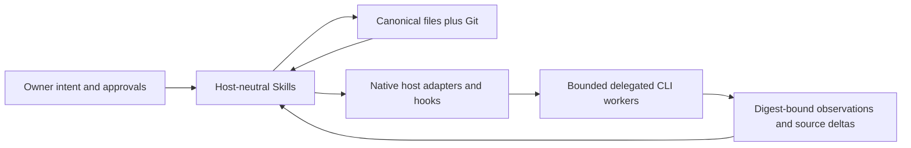
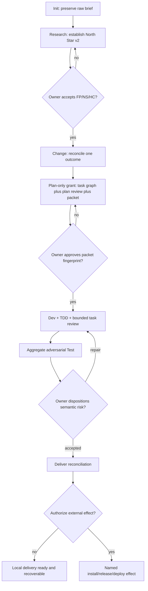

# Ultra Builder Pro v0.27 终极生命周期闭环施工方案

> **状态**：已接受的施工基线；不是实现完成证明  
> **Change**：`chg-v027-lifecycle-closure`  
> **Base HEAD**：`fc055021bcfeee3e8c6781b9545d267f5eb73cbd`  
> **实施分支**：`codex/v027-lifecycle-closure`  
> **恢复副本**：`/Users/rocky243/.codex/backups/ultra-builder-pro-cli-v027-phase0-7Bi7MhBA`  
> **目标版本**：`0.27.0` 候选源码与候选 tarball；本方案不授权 commit、push、tag、npm publish 或 GitHub Release

## 1. 最终目标

v0.27 要把 Ultra Builder Pro 从“文件可恢复的一组工作流”闭合为“以第一性原理为
持续约束、以对抗性审查为持续纠偏、在明确的人类授权内可自主执行的六 Host
coding lifecycle”。完成后，owner 应当能够：

1. 从一个原始想法开始，经 Research 建立可证伪的 North Star；
2. 明确哪些语义决定必须由人作出，哪些执行可以交给 model，哪些事实可以机械校验；
3. 一次批准稳定的执行计划，让同一个 Host 在低风险、可恢复的边界内自动推进至下一个
   owner gate，而不引入 daemon、数据库、MCP 或语义状态机；
4. 在 Research、Change、Plan、每个 task、Test、Deliver 都得到独立的对抗性挑战；
5. 在 Claude Code、Codex、OpenCode、Kimi Code、Grok Build、ZCode 六个 Host 上获得
   原生安装、原生 Hook/插件能力、可核验的跨 CLI 委派与诚实的能力降级；
6. 随时从 owner-readable 文件和 Git 恢复，任何失败都能到达 retry、cancel 或 abandon
   的终态。

最终产品仍然是 file-first plugin，而不是 workflow engine。自动化的载体是 Host model
的原生 agent loop、显式 owner grant、规范化文件和机械传感器；Ultra 不接管意义判断。

## 2. Phase 0 基线与证据边界

开始本 Change 前的可观察事实如下：

- 当前 HEAD 为 `fc055021bcfeee3e8c6781b9545d267f5eb73cbd`；
- 初始工作树有 58 个 `git status --short` 条目；
- 初始状态列表 SHA-256 为
  `fd041c7ab675b6bb23f2cf83d12fe706fa990d83fe35fcf1e85479f98e875624`；
- 初始 tracked binary diff SHA-256 为
  `611bebbb33fd0bc86b4cf67180caf3c8cd5f1143caf1589078cce9e98cbb0338`；
- 这 58 项是本 Change 建立前已经存在的 Phase 0–4 探索性修改。它们统一标记为
  `preexisting/unbound baseline`，不得被倒推成 v0.27 task 的 red-first、review 或完成证据；
- 上述仓库内容已在任何新文件修改前复制到仓库外恢复路径，副本排除了 `.git/` 与
  `node_modules/`，不替代 Git 历史，也不授权破坏性恢复。

恢复优先使用正常 Git diff 或未来 commit 的 revert；若发生不可解释的本地损坏，可从
恢复副本逐文件对比和取回。不得整体覆盖当前工作树。

## 3. 不变的架构红线

v0.27 保留四个平面：



- **语义平面**：十四个 host-neutral Skills；model 解释意图、研究、分解、评估与表达。
- **权威平面**：`.ultra/`、`CONTEXT.md` 和 Git；每个语义事实只有一个 canonical 表达。
- **适配平面**：六个 adapter 吸收安装位置、frontmatter、Hook 事件、权限和 headless argv
  的差异。
- **执行平面**：主 Host 原生 loop 与可选 delegated worker；所有外部 effect 独立授权。

明确不增加：数据库、MCP server、daemon、常驻 scheduler、语义状态机、显式 graph
数据库、新的 `ultra-continue` public Skill，或由 counter/digest 代替 model/owner 判断的
语义 gate。`.ultra/.runtime/`、`.ultra/progress/`、`.ultra/reviews/` 仍是可删除的观察面。

## 4. North Star v2：第一性原理宪法

### 4.1 产生和修改

`ultra-init` 只保存原始 Project Brief，并从 `.ultra-template/north-star.md` materialize
一个结构完整但语义为空的 placeholder；placeholder 必须明确标为 `unresearched`，不得填入
`FP-*`、`NS-*`、`HC-*`、目标、边界或 owner acceptance，也不得把用户愿望改写成产品真理。
`ultra-research` 是 `.ultra/north-star.md` semantic authority 的第一个 writer：它首次 author
并 populate 全部语义内容，并且只有 owner 接受后才成为 steering authority。
后续 Research 可以提出新 revision；`ultra-change` 只在当前 Change 的证据迫使基线修正时
协调修订和 owner 接受。任何 accepted revision 都必须保留 revision identity、来源和
生效时间，不能静默覆盖。

### 4.2 固定承载结构

North Star v2 必须承载以下内容：

1. **Acceptance and Revision**：revision、状态、owner 接受语句、接受时间、supersedes；
2. **Problem Reality**：需要改变的外部现实、影响对象、可观察证据与未知；
3. **First-Principle Propositions**：稳定 ID `FP-*`、命题、证据、因果后果、falsifier 或
   revisit trigger、当前状态；数量由问题决定，不设置机械上限；
4. **Value Causal Chain**：`FP -> capability -> behavior -> outcome`，让 task 能证明自己
   如何服务最终价值；
5. **North Star Outcomes**：稳定 ID `NS-*`、观察方法、baseline、target 或 expected
   change、horizon、anti-metric；不适合单指标时，明确记录 outcome + guardrails；
6. **Hard Constraints**：稳定 ID `HC-*`、受保护价值或具体 threat、约束、权威证据或
   owner 来源、revisit 条件；
7. **Explicit Exclusions**：当前明确不追求的结果；
8. **Uncertainties and Revisit Triggers**：尚未证实的 load-bearing 假设，以及何时必须
   回到 Research；
9. **Research Trace**：Project Brief、研究 run、原始来源、相关 decision。

程序只验证 ID 唯一、引用可解析、必需字段和 digest 等外部事实；不得判断一个 `FP-*`
是否真实、一个 `NS-*`是否“足够好”，也不得用分数自动通过语义内容。

### 4.3 边界分层

| 问题 | Canonical 位置 | 主要 writer | 必需消费者 |
|---|---|---|---|
| 项目为什么存在、第一性原理、全局结果、硬边界、全局排除 | `.ultra/north-star.md` | Research + owner acceptance | Change、Plan、task、Review、Test、Deliver |
| 产品行为、角色、场景、architecture truth | `.ultra/specs/*.md` | Research；Change/Deliver reconcile | 后续所有 workflow |
| 稳定词汇和关系 | `CONTEXT.md` | Domain Modeling | 所有 workflow 与测试命名 |
| 单次 outcome、scope、non-goals、risk、acceptance | active `intent.md` | Change + owner | Plan 至 Deliver |
| task seam、task-local constraint、drift、acceptance | task context | Plan/Dev | Dev、Review、Test、resume |
| 自动化范围、Host、预算、delegation | Execution Packet + intent approval record | Plan projection + owner | automation loop、Status、Test |
| findings、disagreement、disposition、residual risk | Review observations；Test canonical summary | Review/Test + owner disposition | Test、Deliver |
| commit/push/tag/publish/deploy/install/provider spend 等 effect | 当前 owner 原始授权 | owner only | effect executor |

后续 artifact 只引用 `FP-*`、`NS-*`、`HC-*` 和 Change AC ID，不复制 North Star 段落，
避免多个语义镜像漂移。

## 5. 人、Model、机械程序的责任边界

### 5.1 Owner 必须介入

- 接受 Project Brief 的问题边界，以及 North Star 的 `FP-*`、`NS-*`、`HC-*`；
- 接受 Change 的 outcome、reduction、material trade-off、risk profile 和验收；
- 批准稳定的 Execution Packet fingerprint、预算、允许的 workflow、delegation target、
  cross-family 要求和 provider spend；
- 裁决无法由证据消除的 semantic finding、disagreement 与 residual risk；
- 授权任何不可逆、外部、付费、凭据、安全或发布 effect。

### 5.2 Model 自主负责

- 选择最小充分 Research 方法、综合证据、提出可证伪命题；
- 解释 intent、分解 task、设计 seam、选择实现策略与证据；
- 在 grant 内写代码、运行获准检查、调试、TDD、review、test、replan；
- 解释 findings、判断语义完整性、优先级和是否出现证据意义上的 stalled；
- 选择下一条允许 route，并以 owner 能理解的方式表达结果。

### 5.3 机械程序只负责

- path、schema、ID、dependency、digest、snapshot、provenance、permission、资源 ceiling；
- exact executable/argv/cwd check broker、超时、取消、幂等和 terminal receipt；
- 外部 effect 授权是否存在、安装资产 byte integrity、候选包 parity；
- 可重建 observation、typed diagnostic 和明确 recovery path。

Regex、计数、复杂度、digest、validator、timeout 都是 observation，不是产品意义判决。
每个 hard gate 必须写明 invariant、事实来源、被阻止 effect 和可到达的 repair/retry/cancel/
abandon；否则必须是 advisory。

## 6. 完整 Workflow 与自动化边界



Public workflow 仍要求 owner 发起；Skill 文本不得暗中调用另一个 public workflow。
例外不是新增编排器，而是当前 session 中 owner 明确激活的 autonomy grant：Host model
可以在 grant 列明的五个 continuable workflow 中选择下一步，并自动推进到下一个
`requires_owner` gate。新 session 不能继承旧 session 的 live activation。

五个 continuable workflow 固定为 Research、Plan、Dev、Test、Deliver 的低风险本地
部分；Init、Change outcome/reduction、North Star acceptance、risk disposition 和外部
effect 始终保留 owner gate。`ultra-status` 仍只读，报告 durable packet approval、stale
packet、unbound dirty work 和最小下一步；它只能在当前可信 session context 中确实包含
owner activation utterance 时显示 `activation: active`。当前 session 明确没有 utterance 时
显示 `inactive`，Status 无法核实时显示 `unknown`。Status 和任何 artifact 都不得写入、缓存
或推导 persistent activation bit。

## 7. 两阶段 Autonomy 与 Execution Packet v1

### 7.1 Plan-only Grant

第一阶段只允许有界 Research、Plan、Plan Review 和 Execution Packet 生成。write allowlist
是穷举式的，匹配不到即 deny：

- canonical research/planning：`.ultra/north-star.md`、`.ultra/specs/product.md`、
  `.ultra/specs/architecture.md`、`.ultra/specs/discovery.md`、
  `.ultra/specs/research-distillate.md`、`.ultra/research/**`、`CONTEXT.md`、
  `.ultra/changes/active/<change-id>/intent.md`、`.ultra/tasks.json`、
  `.ultra/contexts/task-*.md`；
- derived observation：`.ultra/reviews/<session-id>/**`；
- derived packet：`.ultra/.runtime/execution-packets/<change-id>.json`。

禁止写入任何 product source、build/runtime config、test source、package metadata、Git ref，
也禁止 commit、push、tag、publish、deploy、install、外部数据写入或 provider spend；后者只有
当次另有 exact provider/spend authorization 才可执行。read/browse 可以为 Research 提供
证据，但不扩大 write/effect grant。该 allowlist 把“请自动完成”转化成 owner 可读、可比较、
不可静默扩张的提案。

### 7.2 Execution Packet 的稳定投影

Execution Packet 是 derived deterministic projection，不是第二份 intent，也不 hash 完整
intent。它 materialize 在
`.ultra/.runtime/execution-packets/<change-id>.json`，`$schema` 的 exact value 为
`ultra-execution-packet-v1`。只有 Plan 可以通过同目录临时文件 + atomic rename 持久化；
Status、Change、Plan、Research、Dev、Test、Deliver 都消费同一 materializer/reader contract。

intent 使用 exact normalized stable projection，消除 `Execution Approval` 引用 packet、packet
又 hash approval 的自引用：

- 纳入 header 中 Change ID/title、Profile、Profile rationale、Risk flags；
- 纳入 exact sections：`Outcome`、`North Star Trace`、`Acceptance`、`Non-goals`、
  `Public Seams`、`Research Disposition`、`Planning Posture`、`Unresolved Decisions`；
- 排除 exact sections：`Reconciliation`、`Execution Approval`、`Recovery`，以及任何运行
  evidence、review history、Resume/Completion、timestamp、activation observation；
- normalization：UTF-8 解码、Unicode NFC、CRLF/CR 转 LF、删除每行 trailing whitespace、
  删除 section body 首尾空行、保留内部行序；按上述固定 key 顺序构造 JSON object，JSON
  string 使用标准 escaping、无额外空白、末尾无换行，再对 UTF-8 bytes 做 SHA-256。

fingerprint 只覆盖会改变 owner 批准意义的稳定字段：

- `change_id`；
- North Star revision/digest；
- normalized stable intent projection digest；
- 每个 task 的 id、title、type、priority、context path、dependency、trace、change id；
- context 中稳定的 `Context`、`Implementation`、`Planned Path Inventory`、`Public Seams`、
  `Narrow Verification`、`Acceptance Criteria`、`Definition of Drift` 和 `Trace`；明确排除
  legacy Status/Complexity header、`Change Log`、`Resume Note`、`Completion`、`Task Review`
  及其 packet digest/findings/disposition/evidence refs；
- Plan Review digest；
- allowed workflows、through-test 或 through-local-delivery 边界；
- time/cost/tool/provider budget；
- delegation target、write scope、cross-family 和 cost policy。

明确排除 status、Resume Note、Completion、evidence、review round、runtime counter 等执行中
必然变化的字段，避免“正常推进即自动撤销授权”。不得直接 hash 原始 `tasks.json` 或整个
context 文件。

Plan 写 packet 时必须同时保存 stable projection、projection version 和输入 digests，使任一
consumer 可以重算比较。packet missing 不是语义丢失：Status/Change/continuable workflow
报告 `missing_rebuild_required` 并路由到 Plan；Plan 从 canonical files 重算并 atomic
materialize。packet stale 时，Plan 重建 packet，生成 readable plan-critical delta，并在
fingerprint 改变时等待必要 reapproval；stable fingerprint 未改变时可恢复 durable approval。
任何 consumer 都不得把 missing/stale 当作 permission，也不得在 packet 中保存 activation。

### 7.3 批准、激活与失效

owner 接受 exact fingerprint 和 readable scope/delta 后，`intent.md` 的
`## Execution Approval` 保存唯一 canonical approval record；正式方案、Status 和 packet
都只引用该记录，不复制 owner 原话。它不是永久 live permission。当前 session 的原始
owner 话语才激活执行。新 session 可以在 packet 未变化时用一句明确授权重新激活；任何
plan-critical delta 都生成新 fingerprint 和 readable delta，再等待 owner。

本次 v0.27 自举 Change 的 exact owner acceptance/authorization、来源和 session 边界只保存
在 active `intent.md`。在 packet 机制尚未实现前，该 live utterance 是本次 session 的实施
授权；不得伪造一个事前 fingerprint。实现机制后要生成本 Change 的 packet 并做 self-audit，
但不能把自生成记录冒充 owner 的历史原话；stored quote 在 fresh session 永远 inactive。

会使 packet 失效的事件包括：North Star revision、intent/acceptance/risk 改变、task
稳定投影或 dependency 改变、budget/Host/delegation scope 改变、Plan Review 被替换。
task 运行状态、合法 evidence 更新和 review observation 不使其失效。

删除未被 live path 消费的 `requiresAutonomyEnvelope` 配置；保留并实际测试
`AUTONOMY_CONTINUABLE_SKILLS`。不新增 stage marker 或 persistent workflow position。

## 8. Task、Acceptance 与证据 v2

`.ultra/tasks.json` 成为 task status 的唯一权威。新 task context 不再重复 Status；旧
context 的 Status 作为 legacy observation，迁移时 ledger 胜出并留下 diagnostic。
`complexity` 不再是 required field，也不再驱动 task 数、文件数、时间或 semantic gate；
legacy row 可继续读取。

Acceptance 每一项必须声明 verification type：

| Type | 必需证据 | 通过权威 |
|---|---|---|
| `command` | exact command、exit code、raw evidence ref、exact raw evidence SHA-256、freshness identity | 机械事实 + model 解释 |
| `inspection` | source/path、可观察事实、revision | model 基于证据判断 |
| `owner-judgment` | owner 原始语句或显式 disposition | owner only |
| `external-observation` | provider/run/timestamp/raw evidence ref + exact SHA-256 | 外部事实 + model 解释 |

不能再把所有 acceptance 强制写成 executable command，也不能把 model 自报“pass”当成
命令运行证明。Task 在实现和 task review 期间保持 `in_progress`；只有 blocking finding
解决、相关 evidence 刷新后才写 `completed`。每个 task context/evidence 必须保存此次
task-review 的 Execution Packet digest、review session identity、全部 blocking finding IDs、
逐项 resolution/disposition 和 evidence refresh refs；在 aggregate Test 与 Deliver 都成功
消费该 exact strict session 前，不得删除对应 `.ultra/reviews/<session-id>/`；提前丢失必须
fresh Review + Test，且不得重构旧 receipt。historical dirty work、
无 red test 的旧改动、unavailable provider 都必须如实写 limitation。

删除任意语义数字 gate，包括 `complexity <= 7`、`complexity * 5%`、固定 task/file 数、
最多 12 findings、固定 repair round、三文件即 architecture concern、Skill 行数上限和
固定 owner question 数。资源 timeout、size、cost 预算以及 inventory exact count 仍可
机械执行。

## 9. 全生命周期对抗性审查

六个永久 lens 保持：`spec`、`code`、`tests`、`errors`、`design`、`comments`。不增加
第七个常驻 lens；不同阶段通过 packet 中的问题和证据范围改变挑战目标：

- Research：premise、证据质量、falsifier、North Star 因果链；
- Change：intent attack、遗漏的 reduction、边界和不可逆风险；
- Plan：task graph、public seam、acceptance 可证性、recovery；
- Dev：每个 task diff 的六 lens review；
- Test：整个 Change 的 aggregate review 和 cross-task wiring；
- Deliver：evidence-vs-outcome、文档真相、rollback 与 effect readiness。

每个 worker 收到 immutable packet，输出 unified schema。优先使用 Host 原生 subagent/
Task 并行隔离；没有独立 worker 的 Host 才用 sequential fallback，并在结果中标为
`execution_mode: sequential-shared-context`，同时显式记录 shared-context limitation；
上下文复用本身不强制 `INCOMPLETE`。只有必需的 evidence、worker、artifact 输出缺失或
其他 schema 定义的不完整条件才使用 `INCOMPLETE`；不能假装视角独立。

`SUMMARY.json` 保存全部 findings，不按多数票删除，并新增 `disagreements`：claim、不同
reading、各自 evidence、unresolved 状态和 owner decision。取消 delegate 中 Consensus/
Majority 语义投票。verdict 是 terminal 的：`APPROVE` 即使保留 P2/P3 也结束当前
task review，P2/P3 只进入报告或 owner-selected backlog；`REQUEST_CHANGES` 只路由
exact current P0/P1，一次 in-scope repair set 之后至多一次 affected-lens delta
review，第二次 blocking delta 返回 owner checkpoint。review 按 kind 选 lens：initial
task review 必选 `review-spec` 并按风险与 touched seams 增选，delta review 只重跑
受 exact repair 影响的 lens，aggregate Change review 才可默认全六 lens。新 task
Review packet 至多携带一个 direct parent SUMMARY 与其 unresolved current P0/P1，
不向 lens 重放 transitive 历史。finding 数、repair round 数或 budget exhaustion 都
不能判定“语义已经收敛”或“质量足够”，zero-finding 不是任何完成条件；是否 stalled
由 model 根据证据解释。权限、数据入口、隔离、协议安全和明确 resource ceiling 等
externally verifiable invariant 可以 fail closed，但每个 gate 必须返回 typed
diagnostic 和可到达的 repair/retry/cancel/abandon；budget exhaustion 只停止资源
消费并保持工作可恢复，task 保持 `in_progress`，不能自动 disposition finding 或
产生 pass/fail/accept verdict。

高风险 Change 由 model 针对具体 effect 提出 risk profile，owner 接受。profile 要求时，
必须有 cross-family blind probe；不可用则结果为 `INCOMPLETE` 或记录 owner risk
disposition。worker identity 在可得时记录 provider、model、host、execution identity。

`.ultra/reviews/**` 保持 derived；aggregate findings 和必须的 disagreement 要嵌入
`.ultra/test-report.json`，但 Test 中的嵌入本身不授权删除 review session。exact strict
session 的 `WORKER-PACKET.json`、`ADMISSION.json`、全部 selected specialist artifact 和
`SUMMARY.json` 必须保留到 aggregate Test 与 Deliver 都成功消费；提前丢失必须 fresh
Review + Test，且绝不重构旧 receipt。产品 digest 必须显式排除 `.ultra/reviews/**`、
`.ultra/.runtime/**`、`.ultra/progress/**`，不只依赖 `.gitignore`。

## 10. Delegation Snapshot v1 与 Delegation v2

delegation 不再要求 primary worktree 必须 clean。每次运行建立隔离、可核验的输入：

1. 记录 base HEAD；
2. 捕获 binary-safe tracked diff；
3. 只复制 owner-visible explicit untracked allowlist；默认 deny、遵守 gitignore；
4. 复制选定 canonical `.ultra` context 为 read-only；
5. hard-exclude `.env*`、SSH/cloud credentials、private key、ignored file、repo 外 symlink；
6. 使用 `lstat`，不 follow symlink；执行 size/file/resource ceilings；
7. copy 前、copy 后再次 hash；变化则返回 typed `snapshot_raced` 并允许 retry/cancel；
8. 记录 `snapshot_digest` 和准备好的 `prepared_tree_digest`。

worker delta 必须相对 prepared snapshot 计算，而不是相对裸 HEAD。result/receipt 绑定
snapshot digest、prepared tree digest、worker delta digest、changed files 和 exact
checks；不自动 merge。集成前 primary digest 变化时，停止并让 owner/model选择 rerun、
three-way inspection 或 abandon。

Permission v2 必须绑定 exact provider identity、read scope、write scope、untracked
allowlist、selected read-only `.ultra` paths、snapshot manifest、snapshot digest 和 spend
ceiling，并列出 exact allowed checks：executable、argv、cwd 和 call ID。broker 使用
`execFile` 且不启动 shell；Host model 只能请求获准 check wrapper。worker 无权修改
canonical `.ultra`、commit、push、tag、publish、deploy 或 install。provider 调用自身是
data/spend external effect，必须有当次授权。

本 Change 的 current owner grant 批准的是八个 task context 中 exact planned path inventory
和 path class、六个 named provider、existing-entitlement-only（不新增购买）的 spend boundary，
不是整个仓库或任意 untracked 文件。每次 delegation 必须把该 superset 收窄为 exact paths；
未在 permission 中逐项列出的 untracked path 默认 deny，computed manifest/digest 不匹配时
必须重新生成并由当前 live grant 接受，不能靠 stored quote 自行扩权。

Host argv 修正包括：Grok tool-using run 不使用 `--single`，改用 native
`--json-schema`；Claude 当前版本同样优先 native `--json-schema`；ZCode 只使用当前二进制
能力测试确认为可工作的 flag，不能根据 help 文本虚构 `--max-turns` 或 `--allowed-tools`
可用性。所有 failure type 必须终态化并提供 retry/cancel/abandon。

## 11. 六 Host 原生适配与 Hook 闭合

共同 Skills 保持 host-neutral，adapter 负责语义等价而不是名称一致：

| Host | 安装形态 | Delegation | 必须闭合的特殊点 |
|---|---|---|---|
| Claude Code | native plugin/commands/skills/hooks | headless CLI + schema | native JSON schema；delegated check broker；权限最小化 |
| Codex | generated native plugin/skills | `codex exec` | Hook trust 仍是明确 readiness 状态，不伪装自动激活 |
| OpenCode | native JS plugin + skills | `opencode run` | 验证并接回 mid-workflow/post-edit observation，或明确 limitation |
| Kimi Code | native skills/hooks | `kimi --print` | Hook command 使用受管 plugin root 的绝对路径，不依赖 cwd |
| Grok Build | native skills + wire adapter | `grok -p` | advisory channel 和 deny reason 不得被 wire adapter 丢失 |
| ZCode/GLM | native `plugin.json` + marketplace + skills/hooks | `zcode -p` | plugin 与 provider readiness 分离；验证 compact/event surface；支持双向委派 |

Claude 的 delegated write mode 不因缺少通用 Bash 而扩大权限；exact check broker 是唯一
检查入口。若某 Host 原生事件根本不存在，compatibility matrix 必须记录准确 ceiling 和
便宜的人工替代，不能用最低公分母 emulation 改写全部 Host。

`.ultra/progress/` 是 optional Hook observation；没有它是正常运行状态。`post_edit_guard`
在无 active task 的 dirty edit 上给出 unbound-work advisory，但不能硬阻塞普通 micro edit。
`CONTEXT.md` 要补齐 settled Autonomy、Execution Packet、activation、snapshot、disposition
等词汇。

最终安装必须验证 ZCode native plugin 已安装，并完成 ZCode -> 其余五 Host、其余五 Host
-> ZCode 的双向 delegation 路径。provider 凭据不可用时必须报告真实 `not_ready`，不得把
plugin integrity 当成 provider live success。

## 12. Doctor 与 Provenance v2

Provenance 允许两种同等合法来源：

- `origin.kind = git-worktree`：repository、commit、dirty、worktree digest；
- `origin.kind = npm-tarball`：package name/version、tarball/integrity identity。

两种都记录 runtime-projected asset manifest/digest。合法 npm 安装不能因 Git 字段为 null
被判 unhealthy。

Doctor 必须分开报告：

1. **integrity**：安装内容相对它自己的 manifest 是否完整、缺失、篡改或多出 managed
   orphan；
2. **expected parity**：安装内容是否等于当前 source 或指定 candidate tarball；
3. **activation/readiness**：registry、Hook trust、plugin activation、headless provider
   config 是否可用。

Doctor enum 锁定为：

- `overall`: `healthy_current | healthy_other_build | degraded | broken`；
- `parity`: `current | other_build | unknown`。

`stale` 只能出现在面向人的解释文本，不得成为第五个 overall/parity JSON value。ZCode
plugin health 与 provider readiness 分列。测试必须覆盖 byte mutation、missing
Skill、extra managed asset、错误 source/tarball、null/unknown identity 和 host registry
问题。

## 13. 恢复、失效、放弃与垃圾回收

- North Star 被新 revision 接受后，active Change 标记 stale；Change reconciliation 映射
  全部 trace，Execution Packet 失效，旧 evidence 保留为历史事实；
- abandon 前 intent 增加代码 disposition：keep、revert、successor，必要时记录 successor
  Change ID；绝不自动 destructive revert；
- ledger/context legacy status 不一致时 ledger 胜出，context 只显示迁移 diagnostic；
- budget exhaustion 保持 active task 可恢复，owner 可 extend、retry、cancel、abandon；
- derived artifact 仅在其全部必需 consumer 都成功消费后可删除；exact strict review
  session 遵循 aggregate Test + Deliver 双 consumer 保留契约，canonical history 不自动 GC；
- single canonical writer 仍是文件与 activation contract，不加 lease，除非未来有可复现
  并发失败；
- fresh session 不继承 live activation，必须重新读取文件和 Git 并获得一句新激活语句；
- Status 显示 unbound dirty work、stale packet、legacy context status、host parity/readiness。

## 14. 一次性施工顺序

所有阶段在同一个 `chg-v027-lifecycle-closure` 内完成；每阶段先写可失败 contract test，
再改 authoritative source，随后跑 narrow test 和独立 review。

### Phase 0 — 保护和绑定当前工作

- 建立仓库外恢复副本和本地施工分支；
- 保存本文件、WIP tracker、active intent、task graph 和 context；
- 将原 58 项标为 `preexisting/unbound baseline`；
- 不伪造 TDD、review 或完成证据。

### Phase 1 — North Star constitution

- 更新 template、Research/Change/Status/Deliver、artifact authority 和 schema contracts；
- 将本仓 `.ultra/north-star.md` 迁移成 accepted v2 revision；
- 增加 ID/trace/revision/falsifier 的结构测试，不增加 truth scorer。

### Phase 2 — Task 与 Acceptance v2

- 让 task ledger 成为唯一 Status；迁移 context template 与本仓 contexts；
- 实现四种 verification type、freshness 和 legacy compatibility；`command` 与
  `external-observation` 都以 mechanically safe repository-relative ref 加 exact
  `raw_evidence_sha256` 绑定 bounded stable receipt bytes，aggregate Test 再绑定包含该
  SHA 的 exact `evidence.json` digest；
- 删除 complexity、固定 findings/round/file/line 等 semantic 数字 gate。

### Phase H0 — Harness 循环闭环（2026-08-16 插入，先于 Phase 3）

Phase 2 暴露了一个可复现的 harness 事故：strict self-review 在 `APPROVE + P2` 后
仍未终止，mutable Resume Note 把"再跑一次 zero-finding Review"跨 session 持久化，
Hooks 把 pending frontier 当作 active task 并污染 derived progress。接受的整改合同是
`docs/V027-HARNESS-LOOP-INCIDENT-REMEDIATION.zh-CN.md`（owner-accepted digest
`c39347ca3553175aec06629f710a8541db8a12445e5a17dd90e62e6b75bc2acb`）。H0 修复：

- `APPROVE` 对当前 subject terminal，保留的 P2/P3 不阻断 closeout；
- `REQUEST_CHANGES` 只路由 exact current P0/P1；一次 repair set 加至多一次
  affected-lens delta review；第二次 blocking delta 返回 owner checkpoint；
- budget 只停止执行并返回 `owner checkpoint` / `budget_exhausted`，task 保持
  `in_progress`，不产生任何语义 verdict；
- Resume Note 降级为 navigational context，不得覆盖 scope/budget/acceptance/verdict；
- Hook 只接受唯一 `in_progress` 或 invocation-local trusted exact task id；pending
  frontier 不是 active task，无 live task 时 Hook task-silent、progress-silent；
- 新 task Review packet 至多携带一个 direct parent SUMMARY 与其 unresolved
  current P0/P1，不重放 transitive 历史；
- self-hosting review 使用 owner-accepted baseline 与 read-only external reviewer
  boundary，H0 期间不用本地 `ultra-review` 自批。

H0 由 owner 接受结果后才允许恢复 `v027-autonomy-packet`（Phase 3）。

### Phase 3 — Autonomy 与 Execution Packet

- 实现稳定 projection、fingerprint、delta、approval record、live activation 和 invalidation；
- 接回五个 continuable Skills 与 Status；删除 dead envelope 配置；
- 验证 compaction/fresh session 不会继承授权，普通状态更新不会误撤销授权。

### Phase 4 — 全生命周期 adversarial closure

- 统一六 lens packet/schema/identity/disagreement；
- 接入 Research、Change、Plan、task、Test、Deliver；
- 把 aggregate findings 嵌入 Test；删除投票和任意 count stop。

### Phase 5 — Delegation Snapshot v1

- 先写 dirty snapshot、secret、symlink、race、prepared baseline、exact checks 的回归测试；
- 实现 binary-safe snapshot、Permission/Receipt v2、TOCTOU 和 integration recheck；
- 修正 Claude/Grok/ZCode profile；保留无 auto-merge 和无 external effect。

### Phase 6 — Adapter、Hook、Doctor/Provenance

- 逐 Host 修正 Hook/registry/path/permission，不做统一 emulation；
- 实现 provenance 双来源和 Doctor 三维状态；
- 增加全部负向安装测试和 readiness matrix。

### Phase 7 — 文档、Evals 与 Release Gate

- 同步 README、CHANGELOG、Architecture、Lifecycle、Authority、Compatibility、Isolation、
  Skill Authoring 和决定记录；
- 验证所有 changed Skill、generated Codex plugin、candidate package inventory；
- 独立运行 verification、anti-pattern、code-quality 和六 lens aggregate review。

### Phase 8 — Self migration、真实安装与 live drills

- 迁移本仓 canonical artifacts，生成 fresh task evidence/Test/Deliver；
- 打包一个 exact candidate tarball；先 isolated 安装，再把同一个 candidate 安装到六个真实
  Host；
- Doctor 达到 6/6 exact parity，并分别报告 activation/provider readiness；
- 在已授权、凭据可用的前提下运行 target read/write/invalid/timeout/cancel、跨 Host
  continuation、interruption/compaction/replan/abandon、North Star supersession，以及
  ZCode 双向 delegation；
- 不 commit、push、tag、publish，除非 owner 另行授权。

## 15. 验证矩阵

最低全量 gate：

```bash
npm run verify:release
npm pack --dry-run --json
node bin/install.js --all --global --doctor --json
```

此外必须有真实成功输出支持以下结论：

- 每个 changed Skill 通过 Skill Creator validator；
- generated Codex plugin 的 manifest/marketplace 改动通过 Plugin Creator validator；
- isolated config roots 中 install -> doctor -> reinstall -> uninstall 可恢复；
- candidate tarball 作为 consumer 输入能 init 并产生 North Star v2、tasks v2、Test v2；
- 六 Host integrity/parity/readiness 状态符合真实安装；
- Snapshot 对 secret、ignored、symlink、race、binary diff、untracked allowlist 都 fail closed；
- packet 的 plan-critical delta 必须失效，status/evidence delta 不失效；
- owner-judgment 不可由 model/validator 自动 pass；
- cross-family 或 provider 不可用时结果诚实为 `INCOMPLETE`/`not_ready`。

任何测试绿灯只证明机械规则如写运行，不证明 North Star 真实、产品质量足够或 residual
risk 已被接受；这些仍由 model 综合和 owner 裁决。

## 16. Done Condition

只有同时满足以下条件，才能说 v0.27 本地施工“百分之百完成”：

1. H0 与 Phase 1–8 的 task 全部在 ledger 中完成，并有 fresh evidence；H0 在 owner
   接受其外部人工审查结果前保持 `in_progress`，Phase 3 不得绕过它启动；
2. North Star v2 从 Research 到 Deliver 的每条 `FP/NS/HC` trace 可解析；
3. 两阶段 autonomy 的批准、激活、失效、恢复和 fresh-session 边界被真实测试；
4. 六阶段对抗审查都接入 live consumer，Test 内含完整 aggregate findings/disagreement；
5. dirty delegation 与 exact check broker 的安全/恢复 contract 全部通过；
6. 六个 adapter、Hook、Doctor、provenance 和 candidate install 均通过负向与正向测试；
7. `npm run verify:release`、pack dry run、全部 validator、isolated consumer、真实六 Host
   Doctor 都有当前成功证据；
8. ZCode native plugin、provider readiness 和双向跨 CLI 结果分别如实证明；
9. 文档与 live code path 一致，WIP tracker 已清空并删除；
10. 所有未完成、fake、limitation、external effect 与 residual risk 都显式列出。若仍有一项
    required acceptance 无法验证，就只能报告 `INCOMPLETE`，不能以“95% 置信度”替代证据。

## 17. 外部 Effect 与交付边界

owner 已授权本次源代码施工、真实六 Host 安装和为 acceptance 所需的有界 CLI 调用；执行
时仍要避免输出或复制凭据，并记录真实 spend/readiness。以下 effect 没有被本方案自动
授权：commit、push、tag、npm publish、GitHub Release、生产部署和任何未命名的外部写入。
完成后交付当前 diff、精确命令结果、安装状态、residual risk 与恢复路径，由 owner 决定
下一步版本控制和发布动作。
