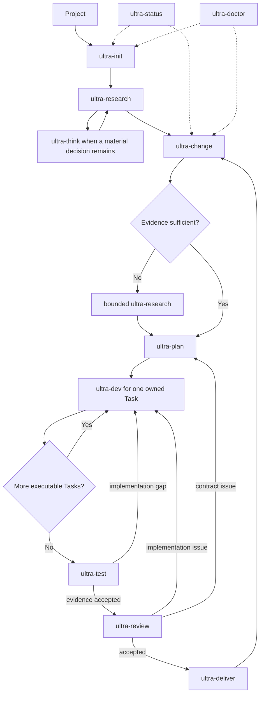

# Ultra Builder Pro workflow lifecycle

Ultra is an adaptive capability graph, not an automatically chained pipeline. The
current Skill inspects authority and recommends a next capability. The user explicitly
starts that capability. Skills own semantic procedure; the seven-tool MCP kernel owns
persistence and mechanical safety across Claude Code, Codex, OpenCode, Kimi Code, and
Grok Build.

## Capability graph



The graph is guidance, not database authorization. A quick, well-understood Change may
skip extra research, but it still needs an explicit Plan, Task contract, Context,
verification, review, and delivery evidence. `ultra-status` is read-only.
`ultra-doctor` repairs mechanical authority only.

## Shared command contract

Every public Skill follows the same boundary:

1. read the current `ultra.context`;
2. inspect checkout/runtime facts directly;
3. identify the smallest unresolved semantic choice;
4. recommend a route and ask only when user intent is not already explicit;
5. persist normalized facts through typed `ultra.record`;
6. update the owning semantic/evidence files;
7. save or accept the stage through `ultra.checkpoint`;
8. read back current authority;
9. report diagnostics and recommend, but do not launch, the next Skill.

No command records ceremonial steps merely to satisfy SQLite.

## Capability ownership

| Skill | Semantic owner | Durable output |
|---|---|---|
| `ultra-init` | repository classification, scope, Git/runtime bootstrap | initialized local authority and empty/imported team checkpoint |
| `ultra-research` | adaptive evidence coverage and accepted baseline | baseline specs, research evidence, Decision Records, baseline checkpoint |
| `ultra-think` | one load-bearing owner decision or bounded diagnosis | normalized Decision Record and applied references |
| `ultra-change` | feature/fix/refactor/incident contract | active Change intent, classification, delta and decision scope |
| `ultra-plan` | Task contracts, topology, ownership, acceptance coverage | accepted Plan checkpoint, deterministic plan files, team checkpoint |
| `ultra-dev` | one owned vertical Task implementation | Worker Packet output, task outcome, implementation evidence checkpoint |
| `ultra-test` | risk-selected executable validation | test report and accepted test checkpoint |
| `ultra-review` | independent spec fidelity and engineering quality | specialist artifacts, coordinated summary, accepted review checkpoint |
| `ultra-deliver` | documentation/spec reconciliation and local archive | delivery evidence, converged baseline, immutable archive, team checkpoint |
| `ultra-status` | current Context rendering | no state mutation |
| `ultra-doctor` | mechanical health, migration, backup and repair | diagnostic/repair report; no product decision |

## Context and decisions

One canonical Context Envelope flows through Skill, Hook, Session, Agent, and compact
recovery. Accepted Decision Records are always visible, including when no workflow is
active. A new session therefore resumes from accepted intent rather than reconstructing
it from conversation.

Decision history is append-only through supersession:

```text
proposed -> accepted -> superseded
         -> rejected
```

The status of a proposal never grants execution authority. The accepted record, its
digest, applied references, and the owning checkpoint do.

## Checkpoints, not fixed steps

Stage authority is revisioned:

```text
draft revision N
  -> accepted revision N
  -> accepted revision N+1 supersedes N
```

A failed acceptance returns diagnostics and keeps the same draft mutable. Plan export
is part of Plan checkpoint publication, so changing a Task contract before acceptance
cannot invalidate an already-recorded “export step.” There is no locked intermediate
run to cancel or manually repair.

Accepted checkpoints are immutable evidence. New facts create a replacement draft.
Only archive history is terminal; subsequent product work opens a new Change.

## Change lifecycle

Live v0.24 writes only:

```text
active -> archived
   |
   -> cancelled
```

`blocked`, `ready`, and `needs_attention` are derived diagnostics, not absorbing Change
states. An active Change may be revised. Archive requires complete current Task,
Context, test, review, documentation, and delivery checkpoints, then performs a
recoverable filesystem/DB transaction. Archived bytes remain immutable.

Older `ready` or `blocked` rows are readable migration history. They do not authorize
new work until migration/revalidation derives current checkpoint authority.

## Task and Session lifecycle

Task durable outcomes remain portable:

```text
pending -> completed
   |
   -> blocked
   -> cancelled
```

`in_progress`, Worker ownership, leases, PIDs, heartbeats, worktrees, and completion
commit backfill are checkout-local. They are not published to Git.

`ultra.session acquire` atomically:

1. checks a real lease/CAS conflict;
2. compiles or reuses the exact Context Envelope;
3. creates an immutable Worker Packet;
4. allocates the lease/worktree;
5. returns packet path/digest and exact execution boundary.

A missing semantic detail is diagnostic, not a transport failure. A genuine lease,
digest, unsafe path, or concurrent authority conflict fails closed. Optional
orchestration can dispatch only a Change-owned Task with an accepted Plan checkpoint
and assigned Worker Packet.

## Team sync

`.ultra/tasks/tasks.json` is a tracked, digest-chained team checkpoint. It carries
portable baseline, Change, Decision summary/reference, accepted Stage Checkpoint, Task
contract, dependency, and durable outcome records. It excludes local execution state.

`ultra.sync` supports:

- `inspect`: side-effect-free condition and migration advice;
- `migrate`: exact-byte backup-first legacy conversion;
- `import`: schema/digest/ancestry/CAS validation and clean fast-forward;
- `publish`: reconcile incoming Git authority, then publish one new generation.

Same-record concurrent edits return a typed conflict. Ultra does not silently choose
one intent. Imported accepted baseline authority requires checkout-local source/spec
revalidation before descendant publication.

Metadata-only Ultra commits do not make a baseline stale. Source or specification
drift remains visible and may require revalidation.

## Hook lifecycle

Hooks do not drive the capability graph. They:

- inject a bounded Context Envelope where the host consumes it;
- protect the team checkpoint and generated projections from direct writes;
- save/restore minimal compact recovery state;
- record minimal lifecycle identifiers;
- return advisory Stop context.

When a host ignores Hook stdout, the adapter records health/events only and every Skill
reads `ultra.context` explicitly. Hook limitations are never presented as successful
context injection.

## Recovery

Use `ultra.context` first; legacy input must return a discoverable migration action
instead of blocking diagnosis. Use `ultra.sync migrate` for semantic conversion and
`ultra.doctor { repair: true }` for mechanical backup/recovery.

Migration supports v4.4/v4.5 projections and v0.22/v0.23 database/ledger authority.
It is exact-byte backup-first, transactional, and fail-closed on conflict. Legacy
workflow/dialogue rows survive as history but do not authorize current work.

Repair never invents a product choice, edits a semantic artifact to make it pass, or
asks the user to hand-edit SQLite.

## Hard-error boundary

Only these classes fail the tool call:

- database/schema corruption;
- unsafe path, symlink, or identity swap;
- actual digest, CAS, or lease concurrency conflict;
- missing/incompatible native runtime;
- permission failure;
- archive/publish/deploy or another irreversible external-effect failure.

Evidence gaps, incomplete exploration, stale optional context, missing reports, or a
checkpoint that is not yet ready are structured diagnostics. The model remains free to
investigate, revise, and retry.
